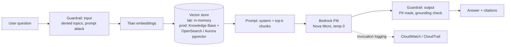

# Capstone — Grounded Customer-Support Assistant

> One small, real system that forces you to make every decision the exam asks about.

You extend lab03 (RAG) and lab05 (Guardrails) into an assistant for a fictional online shop, evaluate it,
and write the 3 short documents a practitioner is expected to reason about. The **documents matter more
than the code** for AIF-C01: the exam tests decisions, not implementation.



## Steps

1. **Data:** replace `DOCS` in `labs/lab03_rag.py` with 3–5 pages of your own text (a product FAQ, a public policy…). No real customer data.
2. **Guardrail:** `python labs/lab05_guardrails.py --keep`, then set `AIF_GUARDRAIL_ID` to the printed id.
3. **Evaluate:** add 4+ questions to `GOLDEN` in `capstone/eval_assistant.py` for your data, then run
   ```bash
   python capstone/eval_assistant.py
   ```
   Target ≥ 80% task completion and 100% correct refusals. Iterate on the system prompt, chunking or `k`, and record what changed.
4. **Write the 3 documents below** (in this folder, 1 page each).
5. **Cleanup:** delete the guardrail (Bedrock → Guardrails), unset the env var.

## Deliverable 1 — `decision-record.md` (covers all 5 domains)

Answer in 1–3 lines each:

| # | Question | Domain |
|---|---|---|
| 1 | Is AI the right tool here, or would a rules engine / search page do? What's the cost-benefit? | 1.2 |
| 2 | Traditional ML or FM? Why? | 1.2 |
| 3 | Which model and why (cost, latency, modality, context length, language support)? Estimated monthly cost for 10k questions/day using lab02's cost math. | 2.1, 2.3, 3.1 |
| 4 | Why RAG and not fine-tuning? When would you fine-tune or distill instead? | 3.1, 3.3 |
| 5 | Which vector store would you use in production and why? | 3.1 |
| 6 | Prompting technique used and how prompts would be versioned (Prompt Management). | 3.2 |
| 7 | Would an agent (tools, e.g. "check my order status") add value? What would it need — tools via MCP/AgentCore Gateway, identity, policy? | 2.1, 3.1, 5.1 |
| 8 | Evaluation plan: offline (golden set, LLM-as-judge, Bedrock Model Evaluation RAG eval) and online (business metrics). | 3.4 |
| 9 | Top 3 risks (hallucination, prompt injection, PII leakage…) and the control for each. | 4.1, 5.1 |
| 10 | Shared responsibility split and Scoping Matrix scope. | 5.1, 5.2 |
| 11 | Logging, retention, data residency choices; services for audit (CloudTrail, Config, Artifact…). | 5.2 |

## Deliverable 2 — `model-card.md`

Intended use · out-of-scope uses · model + data sources · evaluation results (paste eval output) ·
known limitations and biases · human oversight / escalation path · owner and review cadence.
(Mirrors SageMaker Model Cards — Domain 4.2.)

## Deliverable 3 — `eval-report.md`

Golden set results before/after each change, judge disagreements you spotted by hand (why LLM-as-judge still
needs human spot checks), cost per interaction, and one thing that surprised you.

## Done when

- [ ] eval ≥ 80% task completion, all refusals correct
- [ ] 3 documents written
- [ ] you can explain every box in the diagram and every row in the decision record without notes
- [ ] guardrail deleted
