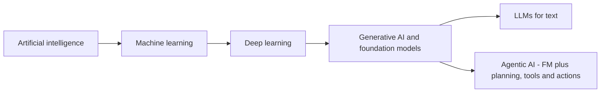
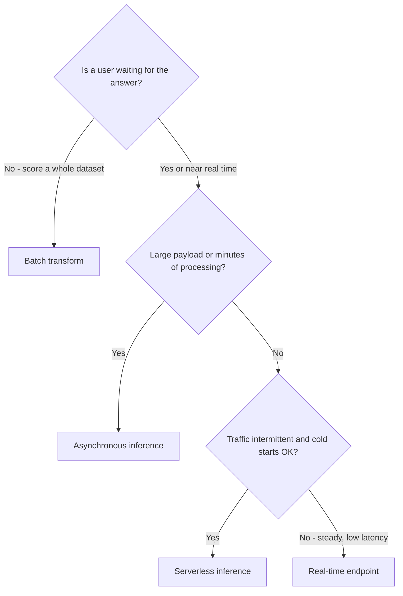
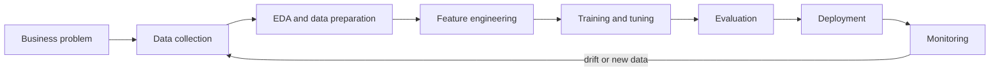

# Domain 1 course — Fundamentals of AI and ML (20%)

Domain 1 checks that you speak the language of AI. You will not build models on this exam. You need to recognise what kind of problem a business has, which kind of AI fits it (if any), how a model goes from idea to production, and which AWS service to use at each step. The domain is worth **20% of the scored content**, so about 10 of the 50 scored questions.

**Study time:** about 6–8 hours. That is 4–5 hours of reading, 1 hour of labs and 1 hour of quiz and review.

**How to use this course**

1. Read one module from start to finish. Do not skip the callouts: **Exam tip** marks the pattern the exam rewards, and **Trap** marks the wrong answer it hopes you pick.
2. Answer the 5 **Check yourself** questions at the end of the module *before* you open the answers.
3. Do the **Hands-on** lab linked from the module.
4. When all three modules are done, run the domain quiz: `python quiz/quiz.py --domain 1`. Aim for at least 80%.

> **Exam tip:** Exam guide v1.1 (published 2026-04-30) added **agentic AI**, **asynchronous and serverless inference**, **knowledge bases and agents as real-world applications**, **traditional ML vs foundation model choice**, and the services **Amazon Quick** and **Kiro**. Older courses and question banks leave these out. This course covers them.

---

## Learning objectives

| Official task statement | What you will be able to do | Module |
|---|---|---|
| **1.1** Explain basic AI concepts and terminologies | Define AI, ML, deep learning, neural network, CV, NLP, model, algorithm, training, inference, bias, fairness, fit, LLM, GenAI and agentic AI. Tell them apart. Choose an inference type. Name data types and learning types. | Module 1.1 |
| **1.2** Identify practical use cases for AI | Say when AI adds value and when it does not. Pick regression, classification or clustering. Map real-world applications to AWS managed AI services. Choose between traditional ML and a foundation model. | Module 1.2 |
| **1.3** Describe the AI/ML development lifecycle | Name the stages of an AI/ML pipeline. Name where models come from and how they are served. Map AWS services to stages. Explain MLOps. Choose model metrics and business metrics. | Module 1.3 |

---

## Module 1.1 — Explain basic AI concepts and terminologies

### Lesson 1.1.1 — The vocabulary: AI, ML, model, algorithm, training, inference

**Artificial intelligence (AI)** is the broad goal: computer systems doing tasks that normally need human intelligence, such as understanding language, recognising images, making decisions or solving problems. A hand-written rule engine that plays chess is AI. So is a chatbot.

**Machine learning (ML)** is a subset of AI. Nobody writes the rules by hand. The system **learns patterns from data**. You show it thousands of past loan applications with the outcome (repaid or defaulted), and it works out the patterns that predict the outcome.

The key words:

| Term | Plain meaning | Analogy |
|---|---|---|
| **Algorithm** | The learning *method* (the recipe), for example linear regression, decision tree, XGBoost, k-means | A cooking technique |
| **Model** | What the algorithm produces after it learns from data: a file of learned parameters that can make predictions | The finished dish, ready to serve |
| **Training** | Running the algorithm on data so it learns patterns and produces the model | A student studying past exam papers |
| **Inference** | Using the trained model to make a prediction on new data | The student sitting the real exam |
| **Features** | The input columns the model looks at (age, income, amount) | The clues |
| **Label / target** | The answer the model should predict (default yes/no, price) | The answer key |
| **Parameters / weights** | Numbers inside the model that training adjusts | The student's memory |
| **Hyperparameters** | Settings you choose *before* training (learning rate, number of trees) | How long and how hard the student studies |

> **Exam tip:** "Algorithm" and "model" are not the same thing. The algorithm is the method. The model is the trained result. A question that asks what is *deployed to an endpoint* is asking about the **model**.

> **Trap:** Training and inference have very different costs. Training is usually done once or occasionally and uses a lot of compute. Inference happens every time someone uses the model, so in production it is often the bigger *ongoing* cost.

### Lesson 1.1.2 — Deep learning, neural networks, computer vision and NLP

A **neural network** is a model built from layers of simple connected units ("neurons"), loosely inspired by the brain. Each layer turns its input into a slightly more abstract representation. In an image, the first layer may find edges, the next shapes, the next "an eye", and the last "a cat".

**Deep learning** means ML with neural networks that have *many* layers. It is the technique behind modern image recognition, speech recognition and language models. Compared with traditional ML it:

- learns features by itself from raw data (pixels, audio, text), so nobody has to hand-engineer them,
- needs much more data and compute (often GPUs),
- is harder to explain.

Two big application areas run mostly on deep learning:

| Area | What it does | Examples | AWS service |
|---|---|---|---|
| **Computer vision (CV)** | Understands images and video | Object and face detection, defect detection on a production line, content moderation, reading text in images | Amazon Rekognition (images and video), Amazon Textract (documents) |
| **Natural language processing (NLP)** | Understands or produces human language | Sentiment, entity extraction, translation, summarisation, chatbots | Amazon Comprehend, Amazon Translate, Amazon Lex, LLMs on Amazon Bedrock |

Speech sits between the two: **speech recognition** (speech to text, Amazon Transcribe) and **speech synthesis** (text to speech, Amazon Polly).

### Lesson 1.1.3 — GenAI, LLMs, foundation models and agentic AI

**Generative AI (GenAI)** is deep learning that **creates new content** (text, images, code, audio, video) instead of only labelling or scoring existing content. A classic ML model answers "is this email spam?". A GenAI model writes the reply.

A **foundation model (FM)** is a very large deep learning model pre-trained on huge amounts of broad data. It can be adapted to many tasks: one model can summarise, translate, classify and write code. Examples on AWS are Amazon Nova, Anthropic Claude, Meta Llama and Mistral models, all available through **Amazon Bedrock**.

A **large language model (LLM)** is a foundation model that specialises in text. It works on **tokens** (pieces of words) and predicts the most likely next token, again and again. Most LLMs use the **transformer** architecture. (Domain 2 goes deeper on tokens, embeddings and transformers.)

**Agentic AI** is the newest layer. An **AI agent** wraps a foundation model in a loop. It is given a goal, **plans** steps, **calls tools** (APIs, databases, search, code), looks at the results, and keeps going until the goal is reached. It acts, not just answers.

- A chatbot (GenAI): "Here is how you would rebook your flight."
- An agent (agentic AI): looks up your booking, checks seats, rebooks you, emails the confirmation, and asks you only when a choice needs a human.



| Concept | Is a subset of | Core idea | Example |
|---|---|---|---|
| AI | — | Machines doing tasks that need intelligence | Rule-based chess engine, any of the below |
| ML | AI | Learns patterns from data instead of hand-written rules | Churn prediction from customer history |
| Deep learning | ML | Many-layered neural networks; learns features from raw data | Recognising faces in photos |
| GenAI | Deep learning | Creates new content; built on foundation models | Writing a product description |
| LLM | GenAI | A foundation model for language, works on tokens | A chat assistant |
| Agentic AI | Builds on GenAI | An FM that plans, uses tools and takes actions toward a goal, often over many steps | An agent that resolves a support ticket end to end |

> **Exam tip:** Read the verb. **Predict, classify or score** points to traditional ML. **Generate, summarise, draft or chat** points to GenAI. **Complete a multi-step task, take actions or call systems** points to agentic AI.

> **Trap:** "All AI is ML" is false. Rule-based expert systems are AI without learning. And "all ML is deep learning" is false: decision trees and linear regression are ML but not deep learning.

On AWS, agents are built with **Amazon Bedrock Agents**, **Amazon Bedrock AgentCore** (runtime, memory, identity and gateway to run agents securely at scale) and the open-source **Strands Agents** SDK. Business users get ready-made agents in **Amazon Quick**, and developers in **Kiro**. Domains 2 and 3 cover how agents work. For Domain 1 you only need to recognise agentic AI as a concept and a use case.

### Lesson 1.1.4 — Bias, fairness and fit

These three words appear in the 1.1 objectives because they explain why models go wrong.

**Fit** describes how well a model has learned the real pattern:

| Situation | Training performance | Performance on new data | What happened | Typical fixes |
|---|---|---|---|---|
| **Underfitting** | Poor | Poor | The model is too simple. It never learned the pattern (**high bias**). | More or better features, a more complex model, train longer |
| **Good fit** | Good | Good (close to training) | The model learned the general pattern | Keep it, and monitor it |
| **Overfitting** | Excellent | Much worse | The model memorised the training data, noise included (**high variance**) | More and more varied data, regularisation, a simpler model, early stopping |

Analogy: an underfit student skimmed the book and fails everything. An overfit student memorised last year's answers word for word and fails as soon as the questions change.

**Bias** has two meanings, and the exam uses both:

1. **Statistical bias** is the error from a model that is too simple (underfitting). It is one half of the bias/variance trade-off.
2. **Bias in the fairness sense** is when a model systematically favours or disadvantages a group. It usually comes from **unrepresentative or historically skewed training data**. A hiring model trained on 10 years of mostly male hires learns to prefer male candidates.

**Fairness** is the goal that a model's outcomes do not unjustly differ across groups (gender, age, ethnicity and so on). On AWS, **Amazon SageMaker Clarify** detects bias in data and models and explains predictions. Domain 4 (Responsible AI) goes deeper.

> **Exam tip:** "Great on training data, poor on test data" is **overfitting**, every time. "Poor on both" is **underfitting**.

> **Trap:** A model can be accurate *and* unfair. High overall accuracy says nothing about how it treats a minority group. That is why bias is measured per group.

### Lesson 1.1.5 — Types of data

Models learn from data, so the type of data limits what you can do.

| Distinction | Meaning | Examples |
|---|---|---|
| **Labeled** | Each example comes with the correct answer | Emails marked spam / not spam, X-rays marked by radiologists |
| **Unlabeled** | Raw examples with no answer | A pile of customer transactions, millions of web pages |
| **Structured** | Fits a fixed schema of rows and columns | Database tables, CSV files |
| **Semi-structured** | Has tags or keys but a flexible schema | JSON, XML, logs |
| **Unstructured** | No predefined schema | Free text, images, audio, video, PDFs |

And by shape:

| Data type | What it looks like | Typical use |
|---|---|---|
| **Tabular** | Rows (records) and columns (features) | Credit scoring, churn, pricing (traditional ML is strong here) |
| **Time-series** | Values recorded in time order; the order matters | Sales forecasting, sensor readings, stock prices, energy demand |
| **Image / video** | Pixels (frames, for video) | Defect detection, face detection, medical imaging |
| **Text** | Sequences of words or tokens | Sentiment, classification, chat, summarisation |
| **Audio** | Waveforms | Transcription, voice assistants |

Labels are expensive because humans usually have to produce them. **Amazon SageMaker Ground Truth** manages data labeling with human workers (your own team, vendors or Amazon Mechanical Turk) and can add automated labeling.

> **Exam tip:** Labeled data is a strong hint for supervised learning. "No labels" points to unsupervised learning, or to a pre-trained foundation model that needs no labels from you.

> **Trap:** Time-series is not just tabular data with a date column. The *order* carries the signal, so you must not shuffle it randomly when you split training and test data.

### Lesson 1.1.6 — Types of learning

| Type | Learns from | Goal | Typical tasks | Business example |
|---|---|---|---|---|
| **Supervised** | Labeled data (input plus correct answer) | Predict the label for new inputs | **Classification** (a category) and **regression** (a number) | Will this customer churn? What will this house sell for? |
| **Unsupervised** | Unlabeled data | Find hidden structure | **Clustering**, anomaly detection, dimensionality reduction | Group customers into segments; spot unusual network traffic |
| **Reinforcement learning (RL)** | Rewards and penalties from an environment | Learn a strategy (policy) that maximises total reward over many steps | Sequential decisions | Robot navigation, game playing, warehouse routing, ad bidding |
| **Semi-supervised** | A few labels plus many unlabeled examples | Make the most of scarce labels | Classification with limited labels | Labeling 1% of documents, then learning from the rest |
| **Self-supervised** | Raw data where the data provides its own labels (for example, hide the next word and predict it) | Learn general representations | Pre-training foundation models | How LLMs learn from internet-scale text |

Reinforcement learning matters for GenAI too: **reinforcement learning from human feedback (RLHF)** is a step where humans rank model answers, and the model is tuned toward the preferred ones. It helps make LLMs helpful and safer.

Analogy:
- Supervised is learning with an answer key.
- Unsupervised is sorting a box of mixed Lego bricks with no instructions.
- Reinforcement is training a dog with treats: no answer key, just a reward when it gets closer to the goal.

> **Exam tip:** Look for the keyword. **"Historical data with known outcomes"** means supervised. **"Group" or "segment" with "no predefined categories"** means unsupervised clustering. **"Reward", "trial and error", "agent interacts with an environment"** means reinforcement learning.

> **Trap:** Anomaly detection can be supervised (if you have labeled fraud cases) or unsupervised (if you do not). If the question says the fraud cases are **not labeled**, choose unsupervised.

### Lesson 1.1.7 — Types of inference

Once a model is trained, you have to decide *how* to serve predictions. Amazon SageMaker AI names four options, and the exam loves them.

| Option | How it works | Choose it when … | Watch out |
|---|---|---|---|
| **Real-time inference** | A persistent, always-on endpoint (HTTPS API) on instances you choose; returns a prediction in milliseconds to seconds | Users are waiting: **low latency**, steady or high traffic, one request at a time | You pay for the instances while they run, even when idle |
| **Serverless inference** | SageMaker AI provisions and scales compute for you, down to zero when idle | **Intermittent or unpredictable** traffic, you want **pay per use** and no instance management, and you can **tolerate cold starts** | Smaller payload and time limits than real-time; first request after idle is slower |
| **Asynchronous inference** | Requests go into a **queue**; results land in Amazon S3 and you can be notified (for example through Amazon SNS) | **Large payloads** (up to about 1 GB) or **long processing** (up to about 1 hour), near-real-time is fine; can scale to zero | Caller does not get the answer in the same response |
| **Batch transform (batch inference)** | Runs a job over a whole dataset in S3, writes the results, then shuts down; no persistent endpoint | **Large dataset available up front**, nobody waiting, for example nightly or weekly scoring | Not for interactive use |

Limits are from the SageMaker AI documentation at the time of writing. Check the current documentation for exact numbers.



The same ideas apply to foundation models on **Amazon Bedrock**: on-demand calls (pay per token, serverless), **batch inference** jobs for large offline workloads at a lower price than on-demand, and Provisioned Throughput for guaranteed capacity. Domain 2 covers Bedrock pricing.

> **Exam tip:** Do not pick **real-time** by default. Read for four clues: is someone waiting, payload size, processing time, and traffic shape.

> **Trap:** "Asynchronous" and "batch" both avoid making a user wait, but async handles **individual requests as they arrive** (queued), while batch processes **a whole dataset you already have**.

> **Hands-on:** [Lab 06 guide](lab-06.md) includes a console tour. In the SageMaker AI console you can look at the endpoint configuration options (real-time, serverless, async) without deploying anything.

### Check yourself

**Q1.** A logistics company wants to teach a software robot to move parcels through a warehouse. The robot gets points for fast, safe deliveries and loses points for collisions. There is no labeled dataset of "correct moves". Which type of learning fits?

- A. Supervised learning
- B. Unsupervised learning
- C. Reinforcement learning
- D. Self-supervised learning

<details><summary>Answer</summary>

**C.** Rewards and penalties from interacting with an environment, over a sequence of decisions, is reinforcement learning.
A is wrong: there are no labeled correct answers. B is wrong: the goal is not to find structure in a dataset. D is wrong: self-supervised learning creates labels from raw data (like next-word prediction). It is used to pre-train foundation models, not to learn from rewards.
</details>

**Q2.** A data science team reports that their image classifier reaches 98% accuracy on training images but 71% on images it has never seen. Which statement is correct?

- A. The model is underfitting; use a simpler model.
- B. The model is overfitting; add more varied training images or apply regularisation.
- C. The model has high bias; remove training data.
- D. The model is well fitted; deploy it.

<details><summary>Answer</summary>

**B.** A big gap between training and unseen-data performance is overfitting (high variance). More varied data and regularisation help it generalise.
A and C are wrong: underfitting (high bias) means poor results on training data too. Removing data makes things worse. D is wrong: a 27-point gap is not a good fit.
</details>

**Q3.** An insurer receives claim photos throughout the day. Each claim has a set of high-resolution images totalling about 500 MB, and the damage-assessment model needs several minutes per claim. Adjusters are happy to be notified when the result is ready. Which SageMaker AI inference option fits best?

- A. Real-time inference
- B. Serverless inference
- C. Asynchronous inference
- D. Batch transform run once a month

<details><summary>Answer</summary>

**C.** Large payloads, minutes of processing, requests arriving individually, and notification when done: that is asynchronous inference.
A and B are wrong: their payload and timeout limits are far below 500 MB and several minutes. D is wrong: claims arrive continuously and need results within the day, not a monthly batch.
</details>

**Q4.** A travel company currently has a chatbot that explains how to change a booking. It now wants a system that can look up the booking, check availability, make the change in the reservation system and send the confirmation, asking a human only for exceptions. What is this new capability called?

- A. Supervised classification
- B. Agentic AI
- C. Computer vision
- D. Clustering

<details><summary>Answer</summary>

**B.** A model that plans steps, calls tools (booking lookup, availability, reservation API, email) and takes actions toward a goal is agentic AI.
A is wrong: classification assigns a label and does not act. C is wrong: no images are involved. D is wrong: clustering groups unlabeled data.
</details>

**Q5.** Which pair correctly matches the data with its type?

- A. Recorded customer phone calls: structured data
- B. Hourly electricity consumption for the last three years: time-series data
- C. A product table with price, weight and category columns: unstructured data
- D. Scanned handwritten forms: tabular data

<details><summary>Answer</summary>

**B.** Values recorded in time order, where the order matters, are time-series data.
A is wrong: audio is unstructured. C is wrong: a table with fixed columns is structured and tabular. D is wrong: scanned images are unstructured. A service like Amazon Textract would have to extract them before they become structured.
</details>

---

## Module 1.2 — Identify practical use cases for AI

### Lesson 1.2.1 — Where AI/ML adds value

The exam guide names three kinds of value. Learn them with an example each:

| Value | What it means | Example |
|---|---|---|
| **Assist human decision making** | AI gives a recommendation, score or summary; a human decides | A model gives each loan a risk score; the underwriter makes the final call. A model flags suspicious X-rays for a radiologist to review first. |
| **Solution scalability** | AI handles a volume no team of people could | Moderating millions of uploaded images a day; translating a product catalogue into 20 languages overnight |
| **Automation** | AI removes repetitive manual work completely | Extracting fields from 50,000 invoices a month; transcribing every support call; routing tickets to the right team |

Other benefits that appear in questions: **speed** (decisions in milliseconds), **consistency** (no tired-on-Friday effect), **personalisation** (each user sees different recommendations), and **finding patterns humans miss** (subtle fraud signals across thousands of features).

AI/ML is a good fit when:
- the problem is about **patterns in data** that are hard to write as rules (what does fraud "look like"?),
- there is **enough relevant data** (or a pre-trained model already knows the domain),
- a **probabilistic answer is acceptable** ("85% likely to churn"),
- the rules **change over time** and the system must adapt.

### Lesson 1.2.2 — When AI/ML is NOT the right answer

This is a favourite exam theme. ML gives **predictions** (probabilities with some error), not guarantees. Choose plain software when:

| Situation | Why ML is wrong | Better option |
|---|---|---|
| **A specific, exact outcome is required** and the rules are known | ML adds error to a problem that has a correct answer | Deterministic code: tax formulas, interest calculations, invoice totals, eligibility rules written in law |
| **Cost exceeds benefit** | Data collection, labeling, training, hosting and monitoring cost more than the value created | A simple rule, a spreadsheet, a manual process |
| **Not enough (or poor-quality) data** | The model cannot learn reliable patterns | Collect data first, or use a pre-trained service |
| **Every decision must be fully explained and traced** and a simple rule can do the job | Complex models are hard to explain | Rules, or a simple interpretable model |
| **The problem is rare or one-off** | No pattern to learn, no payback | A human |

**Cost-benefit analysis** means comparing the total cost (development, data, compute, people, maintenance, risk of errors) with the expected value (time saved, revenue gained, losses avoided). If a business rule catches 95% of cases for almost nothing, a model that catches 97% for a large ongoing cost may not be worth it.

> **Exam tip:** Words like **exact**, **always**, **guaranteed**, **deterministic** or **according to the published formula** mean the answer is **not ML**.

> **Trap:** "Use an LLM" is not a free upgrade. An LLM can produce a plausible but wrong number (a hallucination). For calculations that must be exact, the right design is code, or an agent that *calls* code. The model should not compute the answer itself.

### Lesson 1.2.3 — Choosing the technique: regression, classification, clustering

The fastest way to answer these questions: **look at what the output is.**

| Technique | Output | Learning type | Business examples |
|---|---|---|---|
| **Regression** | A **number** on a continuous scale | Supervised | House price, next month's sales, delivery time in minutes, energy demand |
| **Binary classification** | One of **two** categories | Supervised | Fraud or not, churn yes/no, spam or not, defect or OK |
| **Multi-class classification** | One of **several** categories | Supervised | Ticket type (billing / technical / sales), product category, sentiment (positive / neutral / negative) |
| **Clustering** | **Groups** of similar items, with no predefined labels | Unsupervised | Customer segmentation, grouping news articles by theme |
| **Anomaly detection** | Normal vs unusual | Usually unsupervised | Unusual card transactions, faulty sensor readings |
| **Forecasting** | Future values of a time-series | Supervised (regression on time-series) | Demand, inventory, call-centre staffing |
| **Recommendation** | Ranked items a user is likely to want | Various (collaborative filtering and others) | "Customers who bought this also bought …" |

> **Exam tip:** "How much / how many" means regression. "Which one / yes or no" means classification. "Group them, but we have no categories" means clustering.

> **Trap:** Predicting a **probability** of churn (0.73) is still **classification**. The probability is a score used to choose the class. And a "credit score band" (A, B, C) is classification, even though it sounds numeric.

### Lesson 1.2.4 — Real-world applications and the AWS service for each

v1.1 lists computer vision, NLP, speech recognition, recommendation systems, fraud detection, forecasting, **knowledge bases** and **agentic AI**. For each, know a business example and the AWS service a team "without ML expertise" would use.

| Application | Business example | Managed AWS service | If the question says … → pick … |
|---|---|---|---|
| Image and video analysis | Detect unsafe content in uploads, count people, compare faces for ID checks | **Amazon Rekognition** | "detect objects, faces, labels or inappropriate content in images/video" → Rekognition |
| Document processing | Pull fields and tables from invoices, forms, IDs | **Amazon Textract** | "extract text, **forms and tables** from scanned documents" → Textract |
| Text analytics (NLP) | Sentiment of reviews, entities in contracts, PII detection, topic modelling | **Amazon Comprehend** | "sentiment", "key phrases", "entities", "detect PII in text" → Comprehend |
| Translation | Localise a website or chat in real time | **Amazon Translate** | "translate text between languages" → Translate |
| Speech recognition | Transcribe calls, subtitles for videos | **Amazon Transcribe** | "speech to text", "call recordings", "captions" → Transcribe |
| Speech synthesis | Read articles aloud, voice for an IVR | **Amazon Polly** | "text to speech", "lifelike voice" → Polly |
| Conversational interfaces | Chatbot or voice bot that books appointments | **Amazon Lex** | "build a chatbot or voice bot with intents", "same technology as Alexa" → Lex |
| Recommendations | Personalised product or content suggestions | **Amazon Personalize** | "personalised recommendations" with no ML expertise → Personalize |
| Fraud detection | Score transactions for fraud | **Amazon SageMaker AI** (custom model, for example XGBoost or built-in anomaly detection) | "custom fraud model on our transaction history" → SageMaker AI |
| Forecasting | Demand, inventory, staffing | **SageMaker AI** (including no-code **SageMaker Canvas** time-series forecasting) | "business analyst, no code, forecast sales" → SageMaker Canvas |
| Knowledge bases | Employees ask questions and get answers grounded in company documents | **Amazon Bedrock Knowledge Bases** (RAG); business users: **Amazon Quick** | "answer questions from our internal documents with citations" → Bedrock Knowledge Bases |
| Agentic AI | Agents that complete multi-step tasks (process refunds, triage incidents) | **Amazon Bedrock Agents / Bedrock AgentCore**, **Strands Agents**; ready-made agents in **Amazon Quick**; coding agents in **Kiro**; migration agents in **AWS Transform** | "build, deploy and run agents securely at scale" → Bedrock AgentCore |
| Content generation | Draft marketing copy, summarise reports, write code | **Amazon Bedrock** (Amazon Nova and other FMs) | "generate text or images using a foundation model via API" → Bedrock |

Services often chain together. A call-centre analytics pipeline is **Transcribe** (speech to text), then **Comprehend** (sentiment, entities), then optionally **Translate**. A multilingual voice bot is **Lex**, which uses speech recognition, plus **Polly** for the voice.

> **Exam tip:** The phrase **"without ML expertise"** or **"no data scientists"** almost always points to a **managed AI service** (Rekognition, Textract, Comprehend, Transcribe, Translate, Polly, Lex, Personalize) or Amazon Bedrock. It does not point to building a model in SageMaker AI.

> **Trap:** Textract vs Rekognition: *documents* (forms, tables, key-value pairs) → Textract. *Pictures and video* (objects, faces, scenes) → Rekognition. Comprehend vs Lex: Comprehend *analyses* text. Lex *holds a conversation*. Transcribe vs Polly: Transcribe *listens*, Polly *speaks*.

> **Hands-on:** [Lab 04 guide](lab-04.md): run Comprehend (sentiment, entities, PII), Translate and Polly on one customer review. No model, no training, just API calls.

### Lesson 1.2.5 — AWS managed AI/ML services: the capability map

The exam groups services into layers. The higher the layer, the less ML expertise you need.

| Layer | Services | You provide | AWS provides | Who uses it |
|---|---|---|---|---|
| **AI services** (pre-trained, task-specific) | Comprehend, Rekognition, Textract, Transcribe, Translate, Polly, Lex, Personalize | Your data, through an API call | The model, its training and its hosting | Developers with no ML background |
| **GenAI platform** | Amazon Bedrock (FMs, Knowledge Bases, Agents, Guardrails), Bedrock AgentCore | Prompts, your data for RAG or customisation | Serverless foundation models | Developers building GenAI apps |
| **GenAI applications** | Amazon Quick (business users), Kiro (developers), AWS Transform (modernisation) | Your work and data | A finished AI-powered application | End users |
| **ML platform** | Amazon SageMaker AI (Studio, Canvas, JumpStart, Ground Truth, Pipelines, Model Monitor, Clarify, Model Registry, Model Cards) | Data, choice of algorithm, training config | Managed infrastructure for the whole ML lifecycle | Data scientists, ML engineers; analysts through Canvas |

A closer look at the services named in task 1.2:

- **Amazon SageMaker AI**: the fully managed service to **build, train, deploy and monitor your own ML models** at any scale. Use it when no pre-built service fits and you need a custom model on your own data. Highlights: **Canvas** (no-code ML for analysts), **JumpStart** (a hub of pre-trained and open models you can deploy with a click), **Ground Truth** (labeling), **Clarify** (bias and explainability), **Model Monitor** (drift).
- **Amazon Transcribe**: automatic speech recognition. Batch or streaming. Features include speaker identification, custom vocabulary, and PII redaction in transcripts. **Transcribe Call Analytics** adds call insights and **Transcribe Medical** handles clinical speech.
- **Amazon Translate**: neural machine translation, real-time or batch. **Custom terminology** keeps brand and product names consistent.
- **Amazon Comprehend**: NLP on text. Sentiment, entities, key phrases, language detection, PII detection and redaction, topic modelling, plus **custom classification and custom entity recognition** trained on your labeled examples with no ML code.
- **Amazon Lex**: builds conversational interfaces (chat and voice) with **intents** (what the user wants) and **slots** (the details to collect). It integrates with AWS Lambda to fulfil requests and with Amazon Connect for contact centres.
- **Amazon Polly**: text to speech with many lifelike voices and languages. Neural voices, and **SSML** to control pronunciation, pauses and emphasis.

> **Exam tip:** If a pre-trained AI service does the job, it is the **lowest effort and fastest** answer. SageMaker AI is right when the question stresses **custom model, your own algorithm, full control** or **data scientists**.

> **Trap:** Amazon Comprehend can be customised (custom classifier) without leaving the managed service. You do not need SageMaker AI just because the categories are specific to your business.

### Lesson 1.2.6 — Traditional ML or a foundation model? (new in v1.1)

Both are valid tools, and the exam now asks you to pick. Use this comparison:

| Factor | Traditional ML (for example XGBoost, logistic regression on SageMaker AI) | Foundation model (for example Amazon Nova or Claude on Bedrock) |
|---|---|---|
| Best task type | Narrow, well-defined predictions on **structured/tabular** data: churn, fraud, credit risk, demand | **Open-ended language, vision or multi-modal** tasks: summarise, draft, answer questions, extract meaning from messy text |
| Data needed | **Labeled** historical data for this exact task | Little or no labeled data; prompts and examples are often enough |
| **Explainability** | High: feature importance, simple models are transparent, Clarify explanations | Low: very large models are hard to explain; outputs can vary between runs |
| **Regulatory concerns** | Easier to document, validate, audit and reproduce (for example, a credit decision that must explain "why declined") | Harder to justify individual decisions; risk of hallucination; data residency and model-provider terms to review |
| **Operational constraints: latency** | Very fast (milliseconds) on small instances | Slower (time to generate tokens) |
| Operational constraints: cost | Cheap per prediction once trained | Pay per token; can be expensive at high volume |
| Operational constraints: determinism | Same input gives the same output | Probabilistic; can vary unless settings are tightly controlled |
| Time to first prototype | Weeks (collect labels, train, evaluate) | Hours or days (write a prompt) |
| Flexibility | One model per task | One model, many tasks |

**Decision guide**
- Strict regulation, a need to **explain each decision**, **tabular** data, **high volume and low latency**, or a need for **repeatable** outputs → traditional ML.
- Unstructured text or images, **no labeled data**, **many different tasks**, need to **generate** content, or **fast prototyping** → a foundation model.
- Often the answer is **both**: a traditional model scores fraud risk, and an FM writes the case summary for the investigator.

> **Exam tip:** "Regulators require that each loan decision can be explained" points to an interpretable traditional ML model (plus SageMaker Clarify). "Summarise thousands of free-text complaints with no labeled data" points to a foundation model on Bedrock.

> **Trap:** "Newest is best" is not how the exam thinks. An FM for a simple tabular yes/no prediction is usually **more expensive, slower and less explainable** than a traditional model.

### Check yourself

**Q1.** A mortgage lender must give each declined applicant the main reasons for the decision, and regulators audit the model every year. Applicant data is a table of about 40 numeric and categorical fields with 10 years of labeled outcomes. Which approach is most appropriate?

- A. Prompt a large language model on Amazon Bedrock to decide each application
- B. Train an interpretable traditional ML classification model on SageMaker AI and use SageMaker Clarify for explanations
- C. Use k-means clustering to group applicants
- D. Use Amazon Comprehend sentiment analysis on the application form

<details><summary>Answer</summary>

**B.** Tabular labeled data, a yes/no outcome, and strict explainability and audit needs all point to traditional supervised ML. Clarify provides feature-level explanations.
A is wrong: an LLM is harder to explain and audit, costs more, and can vary between runs. C is wrong: clustering has no target and does not decide approve or decline. D is wrong: sentiment of form text has nothing to do with credit risk.
</details>

**Q2.** A city council must calculate parking fines from a published schedule: a fixed amount per violation type, doubled after 30 days unpaid. What should the developers use?

- A. A regression model trained on past fines
- B. A foundation model with few-shot examples of fines
- C. Deterministic rule-based code
- D. Reinforcement learning to optimise fine amounts

<details><summary>Answer</summary>

**C.** The rules are known and the outcome must be exact, so ML adds cost and error with no benefit.
A and B are wrong: both produce predictions that can be wrong for a problem that has one correct answer. D is wrong: nobody wants the fine amounts optimised; they are set by the schedule.
</details>

**Q3.** An online retailer wants to estimate how many units of each product it will sell next week, to plan stock. Which ML technique is this?

- A. Binary classification
- B. Clustering
- C. Regression (time-series forecasting)
- D. Dimensionality reduction

<details><summary>Answer</summary>

**C.** The output is a number (units) predicted from past sales in time order: regression, in its forecasting form.
A is wrong: there are no two categories. B is wrong: clustering groups items and does not predict quantities. D is wrong: dimensionality reduction compresses features and is not a prediction task.
</details>

**Q4.** A media company has a team of web developers and no data scientists. It wants to automatically detect and blur faces in user-uploaded videos and flag inappropriate content. Which service should it use?

- A. Amazon Textract
- B. Amazon Rekognition
- C. Amazon Comprehend
- D. Amazon SageMaker AI with a custom model built from scratch

<details><summary>Answer</summary>

**B.** Rekognition is a pre-trained service for image and video analysis, including face detection and content moderation. It is called through an API, with no ML expertise needed.
A is wrong: Textract extracts text and data from documents. C is wrong: Comprehend analyses text. D is wrong: it works, but it needs ML expertise and far more effort than a managed service that already does the job.
</details>

**Q5.** A hotel chain wants guests to book rooms by voice and text in a mobile app. The bot must understand requests like "two nights from Friday" and ask for any missing details. Which service is the core of this solution?

- A. Amazon Polly
- B. Amazon Transcribe
- C. Amazon Lex
- D. Amazon Translate

<details><summary>Answer</summary>

**C.** Lex builds chat and voice bots. It recognises the intent (book a room), collects the slots (dates, room type), and prompts for missing values.
A is wrong: Polly only converts text to speech. It can give the bot a voice, but it does not understand anything. B is wrong: Transcribe turns speech into text but has no conversation management. D is wrong: Translate converts between languages only.
</details>

---

## Module 1.3 — Describe the AI/ML development lifecycle

### Lesson 1.3.1 — The components of an AI/ML pipeline

An ML project is much more than "train a model". Think of it as a loop:



| Stage | What happens | Plain example (churn prediction) |
|---|---|---|
| **1. Business problem framing** | Define the goal, the success metric and whether ML is even needed | "Reduce churn 10%; predict who is likely to leave in the next 30 days" |
| **2. Data collection** | Gather and integrate data from sources; label it if needed | Pull customer, billing and support data from databases and S3 |
| **3. Exploratory data analysis (EDA)** | Look at the data: distributions, missing values, correlations, imbalance | "Only 5% of customers churn"; "income is missing for 20%" |
| **4. Data pre-processing** | Clean, fix missing values, remove duplicates, format, split into training/validation/test sets | Fill missing income, drop duplicate accounts, split 70/15/15 |
| **5. Feature engineering** | Create or select the input variables that help the model | "Support calls in the last 90 days", "months since last upgrade" |
| **6. Model training** | Run the algorithm on the training data to produce a model | Train an XGBoost classifier |
| **7. Hyperparameter tuning** | Try different settings to find the best-performing model | Test tree depths and learning rates automatically |
| **8. Evaluation** | Measure on held-out test data with the right metrics; compare with business goals | Recall 0.80 on churners; good enough for the retention team? |
| **9. Deployment** | Make the model available to applications (endpoint, batch job) | Nightly batch scores pushed to the CRM |
| **10. Monitoring** | Watch prediction quality, data drift, latency, cost | Customer behaviour shifts after a price change and accuracy drops |
| **11. Re-training** | Refresh the model on new data and redeploy | Re-train monthly, or when drift is detected |

For GenAI the shape is similar, but the stages change: **choose a foundation model**, **prepare data for RAG or customisation**, **engineer prompts**, **evaluate outputs** (human review, benchmarks, LLM-as-a-judge), **deploy with guardrails**, **monitor** (quality, cost per token, safety). Domain 3 covers these in depth.

> **Exam tip:** Questions may describe an activity and ask for the stage. "Analysts plot distributions and find missing values" is **EDA**. "Create a new input 'average basket size' from raw orders" is **feature engineering**. "Accuracy fell three months after launch" is **monitoring**, which leads to **re-training**.

> **Trap:** Tuning and evaluation must use data the model did **not** train on (validation and test sets). Evaluating on the training data hides overfitting.

### Lesson 1.3.2 — Sources of models

You rarely need to train a foundation model from scratch. The options, from least to most effort:

| Source | What it is | Effort and cost | AWS |
|---|---|---|---|
| **Pre-trained AI service** | A model AWS trained and runs for one task | Lowest; just call the API | Comprehend, Rekognition, Textract … |
| **Proprietary FM through an API** | A provider's model (Amazon Nova, Anthropic Claude …), used as is | Low; pay per use; no infrastructure | Amazon Bedrock |
| **Open-source / open-weight pre-trained model** | Publicly released models (Llama, Mistral, many Hugging Face models) that you can host and adapt | Medium; you choose the instance, host it and secure it; check the **licence** | SageMaker JumpStart; some also on Bedrock |
| **Customise a pre-trained model** | Fine-tune or continue pre-training on your data | Medium to high; needs good data | Bedrock model customisation, SageMaker AI |
| **Train a custom model** | Build your own (traditional ML on your data, or, rarely, a whole FM from scratch) | Highest for FMs: huge data, compute and expertise | SageMaker AI (training jobs, HyperPod for large-scale training) |

For traditional ML, "training a custom model" is normal and cheap: you train a churn model on your own table. For foundation models, **pre-training from scratch** is reserved for organisations with unique data and very large budgets.

> **Exam tip:** "Use an open-source model, deploy it in our own account, with control over the instance" → **SageMaker JumpStart**. "Use a foundation model with no infrastructure to manage" → **Amazon Bedrock**.

> **Trap:** Open-source does not mean "no conditions". Model licences can restrict commercial use. Checking the licence is part of model selection (Domain 4 touches on this).

### Lesson 1.3.3 — Methods to use a model in production

| Method | How it works | Pros | Cons | AWS example |
|---|---|---|---|---|
| **Managed API service** | You send requests to a provider's API; the provider runs the model and the infrastructure | No servers, fast to start, scales automatically, pay per use | Less control over the model and runtime; the provider's model versions and quotas apply | Amazon Bedrock, AI services such as Comprehend |
| **Self-hosted API (managed infrastructure)** | You deploy the model to an endpoint in your account; AWS manages the hardware | Control over the model, instance type, scaling and network | You pick and pay for instances, manage scaling and updates | SageMaker AI endpoints (real-time, serverless, async), JumpStart models |
| **Fully self-managed** | You run the model on your own compute | Maximum control and customisation | Most operational work: patching, scaling, monitoring, security | Amazon EC2, Amazon ECS, Amazon EKS, or on-premises |

Think of it like transport. A managed API is a taxi: you say where to go and pay per trip. A SageMaker endpoint is a leased car: you choose the model, AWS services it. A fully self-managed setup is buying and maintaining your own car.

> **Exam tip:** "**Least operational overhead**" → a managed API (Bedrock or an AI service). "**Full control** over the model weights, runtime or hardware" → self-hosted (SageMaker AI endpoint, or EC2/EKS).

> **Hands-on:** [Lab 02 guide](lab-02.md) calls a foundation model through the Bedrock managed API and shows token-based cost per call.

### Lesson 1.3.4 — AWS services for each stage

v1.1 names **Amazon Bedrock, Amazon Q, Amazon Quick, Kiro and SageMaker AI** as examples here. Learn what each is for and who uses it.

| Pipeline stage | AWS service or feature |
|---|---|
| Data storage and collection | **Amazon S3** (the data lake for ML), databases (RDS, Aurora, DynamoDB, Redshift) |
| Data preparation and integration | **AWS Glue** (ETL), **AWS Glue DataBrew** (visual, no-code data cleaning), Amazon EMR (big data), **SageMaker Canvas** data preparation |
| Data labeling | **SageMaker Ground Truth** |
| Build and experiment | **SageMaker Studio** (notebooks and IDE for ML), **SageMaker Canvas** (no-code), **SageMaker JumpStart** (start from pre-trained models) |
| Train and tune | SageMaker AI training jobs, automatic model tuning (hyperparameter tuning) |
| Evaluate and explain | SageMaker Clarify (bias and explainability), SageMaker model evaluation; **Amazon Bedrock Model Evaluation** for FMs |
| Register and govern | **SageMaker Model Registry** (versions and approval), **SageMaker Model Cards** (documentation) |
| Deploy | SageMaker AI endpoints (real-time, serverless, async), batch transform; Amazon Bedrock for FMs |
| Orchestrate (MLOps) | **SageMaker Pipelines** (automated, repeatable ML workflows) |
| Monitor | **SageMaker Model Monitor** (data and model quality drift), **Amazon CloudWatch** (metrics, logs, alarms), **AWS CloudTrail** (API audit) |
| Build GenAI apps and agents | **Amazon Bedrock** (FMs, Knowledge Bases, Agents, Guardrails, Prompt Management), **Bedrock AgentCore**, **Strands Agents** |
| Use AI for business work | **Amazon Quick** |
| Use AI to write and ship code | **Kiro**, **Amazon Q Developer** |
| Use AI to modernise legacy workloads | **AWS Transform** |

The newer services, in one line each:

- **Amazon Bedrock**: a fully managed, serverless service that gives API access to foundation models from Amazon and leading AI companies, plus tools to build GenAI apps (Knowledge Bases for RAG, Agents, Guardrails, model customisation, model evaluation).
- **Amazon Quick** (launched as Amazon Quick Suite): an **agentic AI workspace for business users**. It brings together BI dashboards (Quick Sight, formerly Amazon QuickSight), deep research across company data and the web (Quick Research), and workflow automation (Quick Flows, Quick Automate). It also absorbs the Amazon Q Business assistant experience. Think "non-developers get answers, insights and automations from their company data".
- **Amazon Q**: the AWS family name for its generative AI assistants. **Amazon Q Developer** helps developers write, explain and transform code in the IDE and console. The business assistant capabilities are now delivered through Amazon Quick.
- **Kiro**: an **agentic IDE** for developers. Instead of only autocomplete, it turns a prompt into **specs** (requirements, design, tasks) and then lets AI agents implement them, with hooks that automate checks. Keyword: **spec-driven development**.
- **Amazon SageMaker AI**: the end-to-end platform to build, train, deploy and monitor your own ML models.
- **AWS Transform**: agentic AI that speeds up migration and modernisation (for example mainframe, VMware, .NET workloads).

> **Exam tip:** Match the **user**. Data scientist building a custom model → **SageMaker AI**. Business analyst, no code, tabular prediction → **SageMaker Canvas**. Business user who wants insights, research and automations on company data → **Amazon Quick**. Developer building an app on an FM → **Amazon Bedrock**. Developer who wants AI agents to help write the software → **Kiro** (or Q Developer).

> **Trap:** v1.0 used SageMaker Data Wrangler and Feature Store as examples. v1.1 removed them from this objective. Know that they exist (data preparation and a feature repository), but do not expect them to be the focus.

> **Hands-on:** [Lab 06 guide](lab-06.md) is a Bedrock console tour: playground, Prompt Management, Model Evaluation and a Knowledge Bases walkthrough.

### Lesson 1.3.5 — MLOps fundamentals

**MLOps** applies DevOps ideas to machine learning so that models get to production, and **stay** healthy there, reliably. The exam guide lists seven ideas:

| MLOps concept | Meaning | AWS help |
|---|---|---|
| **Experimentation** | Try many data sets, features, algorithms and settings, and **track** what was tried and what worked | SageMaker Studio, SageMaker experiment tracking (managed MLflow) |
| **Repeatable processes** | The same steps give the same result every time: automated pipelines, versioned code, data and models | SageMaker Pipelines, Model Registry |
| **Scalable systems** | Training and serving grow with data and traffic without a redesign | Managed training, auto-scaling endpoints |
| **Managing technical debt** | ML systems pile up hidden costs: hand-run notebooks, undocumented data dependencies, glue code, models nobody owns. MLOps keeps them clean and documented. | Pipelines, Model Cards, Model Registry |
| **Achieving production readiness** | Tested, secure, monitored, documented, with approval gates and rollback | Model Registry approval, CI/CD, CloudWatch |
| **Model monitoring** | Watch live data and prediction quality for **drift** | SageMaker Model Monitor, CloudWatch |
| **Model re-training** | Refresh the model on recent data, on a schedule or triggered by drift | Pipelines triggered by Model Monitor alerts |

**Why models decay:** the world changes. **Data drift** means the input data no longer looks like the training data (a new customer segment, a new product line). **Concept drift** means the relationship between inputs and outcome changes (what fraud looks like evolves as fraudsters adapt). A model that was 90% accurate at launch can quietly get worse. That is why monitoring and re-training are part of the lifecycle, not optional extras.

> **Exam tip:** "Model accuracy has degraded since deployment because customer behaviour changed" → **drift**. Detect it with **SageMaker Model Monitor**, fix it by **re-training** on recent data, and automate the loop with **SageMaker Pipelines**.

> **Trap:** Deployment is not the finish line. Any answer that implies "train once, deploy, done" ignores monitoring and re-training.

### Lesson 1.3.6 — Model performance metrics

For **classification**, everything starts from the **confusion matrix**. Example: a fraud model looks at transactions.

| | Model says fraud | Model says not fraud |
|---|---|---|
| **Actually fraud** | **True positive (TP)**: caught it | **False negative (FN)**: missed it |
| **Actually not fraud** | **False positive (FP)**: false alarm | **True negative (TN)**: correctly left alone |

| Metric | Question it answers | Formula | Prioritise when … |
|---|---|---|---|
| **Accuracy** | Overall, how often is the model right? | (TP + TN) / all | Classes are **balanced** and both errors cost about the same |
| **Precision** | When the model says "yes", how often is it right? | TP / (TP + FP) | **False positives are costly**: a spam filter that hides a real invoice email; flagging innocent customers |
| **Recall** (sensitivity) | Of all the real "yes" cases, how many did it catch? | TP / (TP + FN) | **False negatives are costly**: missed fraud, missed cancer, missed safety defect |
| **F1 score** | A single balance of precision and recall | 2 × P × R / (P + R) | You need **both**, especially on **imbalanced** data |

You do not need to compute these from memory on the exam, but knowing the formulas makes the meaning stick. A worked example: 1,000 transactions, 20 are fraud. The model flags 30, of which 15 are truly fraud. So TP = 15, FP = 15, FN = 5. Precision = 15/30 = 0.50. Recall = 15/20 = 0.75. F1 = 0.60. Accuracy = (15 + 965)/1,000 = 0.98, which looks great but hides that a quarter of the fraud was missed.

**Why accuracy lies on imbalanced data:** if 1% of transactions are fraud, a model that *always* says "not fraud" scores 99% accuracy and catches nothing. Use precision, recall and F1 instead.

**The threshold trade-off:** most classifiers output a probability, and you choose the cut-off. **Lower the threshold** and you flag more cases: recall goes up, precision goes down. **Raise it** and the opposite happens. The business decides which error hurts more.

Other metrics you may see:
- **AUC-ROC** (area under the ROC curve): how well the model ranks positives above negatives across *all* thresholds. 1.0 is perfect, 0.5 is random guessing. (v1.1 dropped AUC from the objective's example list, but it is still a standard metric.)
- **Regression metrics:** **MAE** (average absolute error, in the target's units), **RMSE** (punishes large errors more), **R²** (share of variance explained, closer to 1 is better).
- **GenAI metrics** such as ROUGE, BLEU, BERTScore and LLM-as-a-judge belong to Domain 3.

> **Exam tip:** Translate the business sentence into an error type. "We cannot afford to **miss** any …" → false negatives → **recall**. "We must not **wrongly accuse / block / bother** …" → false positives → **precision**. "Balance both on imbalanced data" → **F1**.

> **Trap:** Precision and recall for regression is a category mistake. A model that predicts a price uses MAE, RMSE or R², not a confusion matrix.

> **Hands-on:** [Lab 01 guide](lab-01.md): build a confusion matrix from scratch, compute precision, recall and F1, move the threshold and watch the trade-off. Also see why a 70%-accurate "always no" model is useless. It runs offline and is free.

### Lesson 1.3.7 — Business metrics

A model with great F1 can still be a bad investment. The exam guide lists four business metrics:

| Business metric | What it measures | Example |
|---|---|---|
| **Cost per user** (or per prediction or interaction) | Running cost divided by usage: inference compute, tokens, storage | Each chatbot conversation costs a few cents in tokens and hosting; is that less than a human agent's cost? |
| **Development costs** | Data collection and labeling, engineering time, training compute, tooling | Labeling 100,000 images with Ground Truth plus three months of a team |
| **Customer feedback** | Satisfaction scores, thumbs up/down, complaints, adoption | CSAT rose after recommendations were personalised |
| **Return on investment (ROI)** | (Value gained − total cost) / total cost | Fraud losses avoided minus project and running costs |

Others that appear in questions: **revenue uplift**, **conversion rate**, **time saved per task**, **error or rework rate**, **task completion rate** and **user satisfaction** (Domain 3 adds these for GenAI).

**Model metrics vs business metrics:** model metrics tell you the model is *technically* good. Business metrics tell you it is *worth having*. A good evaluation uses both, and the business metric is agreed in stage 1 (problem framing), before any model is trained.

> **Exam tip:** If the question asks whether the project **delivered value to the business**, choose a **business metric** (ROI, cost per user, customer feedback). Do not choose accuracy or F1.

> **Trap:** Raising a model metric is not automatically a business win. Improving recall from 0.90 to 0.92 might double compute cost and flood reviewers with false alarms, lowering ROI.

### Check yourself

**Q1.** A hospital screening model flags patients who may have a serious but treatable condition so that a doctor can review them. Missing a sick patient is far worse than an unnecessary review. Which metric should the team optimise?

- A. Precision
- B. Recall
- C. Accuracy
- D. RMSE

<details><summary>Answer</summary>

**B.** The costly error is a false negative (a missed sick patient). Recall = TP / (TP + FN) measures how many real cases are caught.
A is wrong: precision focuses on avoiding false positives, which here are only extra reviews. C is wrong: the condition is rare, so accuracy can look high while missing patients. D is wrong: RMSE is a regression metric.
</details>

**Q2.** Six months after deployment, a product-demand model's errors have grown steadily. Investigation shows that customer buying patterns changed after a competitor entered the market. What should the team do? (Choose the best answer.)

- A. Switch from real-time to batch inference
- B. Detect the drift with ongoing monitoring and re-train the model on recent data
- C. Increase the endpoint instance size
- D. Retrain the model on the original training data only

<details><summary>Answer</summary>

**B.** Changing real-world patterns cause drift. MLOps answers it with monitoring (for example SageMaker Model Monitor) and re-training on recent data, ideally automated with SageMaker Pipelines.
A and C are wrong: they change how or how fast predictions are served, not their quality. D is wrong: the original data no longer reflects current behaviour, so the model would learn the old patterns again.
</details>

**Q3.** A company wants to use an open-weight large language model, deploy it inside its own AWS account on an instance type it chooses, and fine-tune it later. Which AWS option fits best?

- A. Amazon Comprehend
- B. Amazon SageMaker JumpStart
- C. Amazon Polly
- D. Amazon Quick

<details><summary>Answer</summary>

**B.** JumpStart is the SageMaker AI hub of pre-trained and open models that you deploy (self-hosted endpoint) and fine-tune in your own account.
A is wrong: Comprehend is a pre-trained NLP service. You cannot bring your own LLM to it. C is wrong: Polly is text to speech. D is wrong: Quick is a ready-made workspace for business users, not a place to host your own models.
</details>

**Q4.** A marketing team without developers wants an AI assistant that can research across company documents and dashboards, answer questions about sales data and automate routine reporting tasks. Which AWS service is designed for this?

- A. Kiro
- B. Amazon SageMaker AI
- C. Amazon Quick
- D. AWS Glue

<details><summary>Answer</summary>

**C.** Amazon Quick is the agentic workspace for business users: BI, research over company data, and workflow automation, with no code.
A is wrong: Kiro is an agentic IDE for software developers. B is wrong: SageMaker AI is for building custom ML models and needs ML skills. D is wrong: Glue is a data integration (ETL) service.
</details>

**Q5.** A data science team keeps training models in personal notebooks. Nobody can reproduce last quarter's best model, and every deployment is a manual, error-prone process. Which MLOps practice addresses this most directly?

- A. Increase the training data size
- B. Build automated, versioned pipelines and register models in a model registry
- C. Switch to a larger foundation model
- D. Report model accuracy to the business every month

<details><summary>Answer</summary>

**B.** Automated pipelines (for example SageMaker Pipelines) and a model registry give repeatable, versioned, auditable training and deployment. That removes the technical debt of hand-run notebooks.
A is wrong: more data does not fix reproducibility or manual deployments. C is wrong: changing models ignores the process problem. D is wrong: reporting is useful but does not make the work repeatable.
</details>

---

## Domain summary

| Topic | Remember this |
|---|---|
| Nesting | AI ⊃ ML ⊃ deep learning ⊃ GenAI (FMs, LLMs). **Agentic AI** = an FM that plans, uses tools and takes actions toward a goal over many steps. |
| Algorithm vs model | Algorithm = learning method. Model = trained result that is deployed. |
| Training vs inference | Training = learn from data (occasional, heavy). Inference = predict on new data (every request, the ongoing cost). |
| Fit | Overfit = great on training, poor on new data (high variance) → more data, regularisation, simpler model. Underfit = poor on both (high bias) → more features, more complex model. |
| Bias and fairness | Unrepresentative data → unfair outcomes. Measure per group. SageMaker Clarify. |
| Data | Labeled vs unlabeled. Structured (tables) vs semi-structured (JSON) vs unstructured (text, images, audio). Time-series: order matters. |
| Learning types | Supervised = labels (classification, regression). Unsupervised = no labels (clustering, anomaly). RL = rewards over sequential decisions. Self-supervised = how FMs pre-train. RLHF = aligning LLMs. |
| Inference | User waiting and steady → real-time. Spiky and cold starts OK → serverless. Large payload or long processing, queued → async (up to about 1 GB / 1 h). Whole dataset offline → batch transform. |
| Technique | Number → regression. Category → classification. Groups without labels → clustering. Future values → forecasting. |
| Value of AI | Assist decisions, scale, automate. |
| Not AI | Exact or deterministic outcome required, cost > benefit, no data, a simple rule works. |
| Traditional ML vs FM | Tabular, regulated, explainable, low latency/cost, repeatable → traditional ML (SageMaker AI). Unstructured, no labels, generative, many tasks, fast prototype → FM (Bedrock). |
| "No ML expertise" | Managed AI service or Bedrock, not SageMaker AI. |
| Pipeline | Problem → collect → EDA → pre-process → features → train → tune → evaluate → deploy → monitor → re-train. |
| Model sources | AI service < FM API (Bedrock) < open-weight model (JumpStart) < customise < train from scratch (most effort). |
| Serving | Managed API (Bedrock, AI services): least ops. Self-hosted endpoint (SageMaker AI): control. EC2/EKS: full control, most ops. |
| MLOps | Experimentation, repeatability, scale, tech debt, production readiness, monitoring (drift), re-training. Pipelines + Model Registry + Model Monitor. |
| Metrics | Accuracy (balanced only). Precision (false positives costly). Recall (false negatives costly). F1 (balance, imbalanced data). Regression: MAE, RMSE, R². Lower threshold → recall up, precision down. |
| Business metrics | Cost per user, development cost, customer feedback, ROI. Agree them before training. |
| Who uses what | Data scientist → SageMaker AI. Analyst, no code → SageMaker Canvas. Business user → Amazon Quick. App developer on FMs → Bedrock. Developer coding with agents → Kiro. |

---

## Service glossary

| Service | What it does | Exam keyword |
|---|---|---|
| **Amazon SageMaker AI** | Fully managed platform to build, train, deploy and monitor your own ML models | "custom model", "data scientists", "full control" |
| **SageMaker Canvas** | No-code visual ML (including forecasting) for business analysts | "analyst", "no code", "point and click" |
| **SageMaker JumpStart** | Hub of pre-trained and open-weight models and solutions to deploy and fine-tune in your account | "open-source model", "deploy pre-trained model in our account" |
| **SageMaker Studio** | Web-based IDE for the ML workflow (notebooks, experiments) | "data scientist workspace", "notebooks" |
| **SageMaker Ground Truth** | Data labeling with human workers plus automation | "label training data" |
| **SageMaker Clarify** | Detects bias in data and models; explains predictions | "bias", "explainability", "feature importance" |
| **SageMaker Model Monitor** | Detects data and model quality drift in production | "drift", "quality degraded over time" |
| **SageMaker Pipelines** | Orchestrates automated, repeatable ML workflows (MLOps) | "automate", "repeatable", "CI/CD for ML" |
| **SageMaker Model Registry** | Catalogue of model versions with approval status | "version", "approve for production" |
| **SageMaker Model Cards** | Documents a model's purpose, data, performance and risks | "document the model", "governance" |
| **Amazon Bedrock** | Serverless API access to foundation models plus tools to build GenAI apps | "foundation model", "no infrastructure", "GenAI app" |
| **Amazon Bedrock Knowledge Bases** | Managed RAG: answers grounded in your documents | "company documents", "knowledge base", "citations" |
| **Amazon Bedrock Agents / AgentCore** | Build (Agents) and securely deploy and run at scale (AgentCore) AI agents | "agent", "multi-step tasks", "run agents at scale" |
| **Strands Agents** | Open-source SDK from AWS for building AI agents in code | "open-source agent SDK" |
| **Amazon Nova** | Amazon's own family of foundation models, available on Bedrock | "Amazon-built FM" |
| **Amazon Rekognition** | Image and video analysis: objects, faces, text in images, content moderation | "images", "video", "faces", "moderation" |
| **Amazon Textract** | Extracts text, forms (key-value pairs) and tables from documents | "scanned documents", "forms", "tables", "invoices" |
| **Amazon Comprehend** | NLP: sentiment, entities, key phrases, language, PII, topics, custom classification | "sentiment", "entities", "PII in text" |
| **Amazon Transcribe** | Speech to text (batch and streaming, call analytics, medical) | "speech to text", "transcripts", "captions" |
| **Amazon Polly** | Text to lifelike speech | "text to speech", "voice" |
| **Amazon Translate** | Neural machine translation | "translate", "localise" |
| **Amazon Lex** | Chat and voice bots with intents and slots | "chatbot", "voice bot", "conversational interface" |
| **Amazon Personalize** | Personalised recommendations without ML expertise | "recommendations", "personalised" |
| **Amazon Quick** | Agentic workspace for business users: BI (Quick Sight), research, automations | "business users", "insights and automation from company data" |
| **Amazon Q (Q Developer)** | Generative AI assistant for developers in the IDE and console | "coding assistant" |
| **Kiro** | Agentic IDE with spec-driven development | "spec-driven", "agentic IDE" |
| **AWS Transform** | Agentic AI for migrating and modernising legacy workloads | "modernise", "mainframe", "migrate legacy code" |
| **AWS Glue / Glue DataBrew** | ETL and data integration / visual no-code data cleaning | "prepare data", "ETL", "clean data without code" |
| **Amazon S3** | Object storage; the usual home of ML training data and batch results | "data lake", "store training data" |
| **Amazon CloudWatch** | Metrics, logs and alarms for endpoints and applications | "monitor latency", "alarms" |

---

## Ready for the next domain?

Tick each line honestly. If you hesitate on one, re-read that lesson.

- [ ] I can explain AI, ML, deep learning, GenAI, LLM and agentic AI, and how they nest, in one sentence each.
- [ ] I can tell an algorithm from a model, and training from inference.
- [ ] I can spot overfitting vs underfitting from a description of training and test results.
- [ ] I can explain how biased training data leads to unfair outcomes.
- [ ] I can classify data as labeled/unlabeled, structured/unstructured, tabular/time-series/image/text.
- [ ] I can pick supervised, unsupervised or reinforcement learning from a scenario.
- [ ] I can choose real-time, serverless, asynchronous or batch inference from the clues (waiting, payload, duration, traffic).
- [ ] I can name the three kinds of AI value and at least three situations where AI is the wrong tool.
- [ ] I can pick regression, classification or clustering from the output the business wants.
- [ ] I can map Rekognition, Textract, Comprehend, Transcribe, Polly, Translate, Lex and Personalize to use cases, and avoid the look-alike traps.
- [ ] I can justify traditional ML vs a foundation model using regulation, explainability and operational constraints.
- [ ] I can list the AI/ML pipeline stages in order and name the AWS service for each.
- [ ] I know the difference between a managed API and a self-hosted model, and when to choose each.
- [ ] I know who Amazon Quick, Kiro, Bedrock and SageMaker AI are for.
- [ ] I can explain the MLOps concepts, including drift and re-training.
- [ ] I can choose precision, recall, F1 or accuracy from a business sentence, and name four business metrics.
- [ ] I completed Lab 01 and Lab 04.

Then run the domain quiz and aim for 80% or more:

```bash
python quiz/quiz.py --domain 1
```
