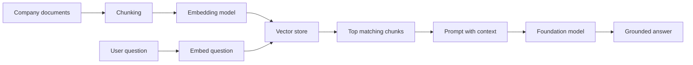
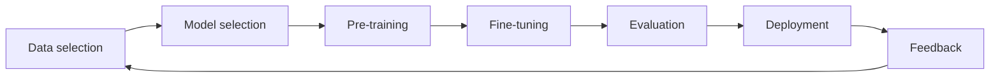
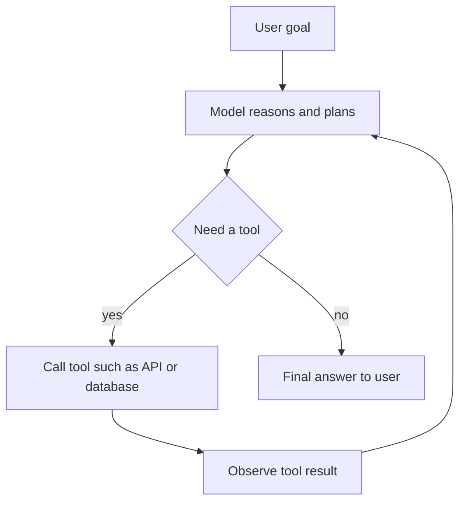
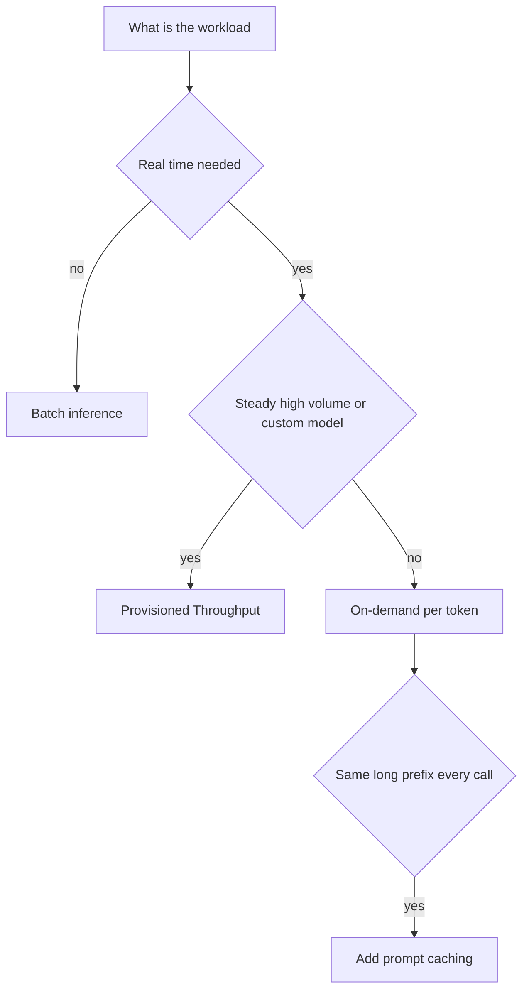

# Domain 2 course — Fundamentals of Generative AI (24%)

Domain 2 is about **what generative AI is, what it is good and bad at, and which AWS services you use to build with it**. It is worth 24% of the scored content — roughly 12 of the 50 scored questions — and together with Domain 3 (Applications of Foundation Models, 28%) it makes up more than half of the exam.

The exam targets a *practitioner*: someone who **uses** AI on AWS and makes good choices, not someone who builds models. You will never be asked to derive a formula or write training code. You will be asked things like "a company wants X with the least operational overhead — which service?" or "users get different answers to the same question — why, and what reduces it?".

**Study time:** about 6–8 hours in total — roughly 3 h reading, 1 h on the Check-yourself questions, 1–2 h on the labs, 1 h on the quiz and reviewing mistakes.

**How to use this course**

1. Read one module (2.1, 2.2, 2.3) end to end. Do not skip the tables — the exam loves "which one fits" comparisons.
2. Answer the **Check yourself** questions at the end of the module *before* opening the answers. Read *why the wrong options are wrong* — that is where most of the learning is.
3. Do the linked lab (`> Hands-on:` callouts). Running a prompt and seeing the token count and the bill makes the theory stick.
4. Finish with `python quiz/quiz.py --domain 2` and aim for 80% or more.

> **Exam tip:** Exam guide v1.1 (published 2026-04-30) added several Domain 2 topics that older courses and practice sets do not cover: **token-based pricing, context engineering, agentic AI (multi-agent patterns, MCP, memory, tool use, orchestration), Amazon Quick, Kiro, Strands Agents, and Amazon Bedrock AgentCore**. Amazon Bedrock PartyRock was removed from the objectives. If a practice source still focuses on PartyRock and has never heard of AgentCore, it is out of date.

---

## Learning objectives

| Official task statement (v1.1) | What you must be able to do | Module |
|---|---|---|
| **2.1** Explain the basic concepts of generative AI | Define tokens, chunking, embeddings, vectors, prompt engineering, transformer LLMs, foundation models, multimodal and diffusion models; name GenAI use cases; describe the FM lifecycle; explain token-based pricing; explain context engineering; define agentic AI concepts (multi-agent patterns, MCP, communication, memory, tools, orchestration) | Module 2.1 |
| **2.2** Understand the capabilities and limitations of GenAI for solving business problems | List advantages and disadvantages (hallucination, interpretability, inaccuracy, nondeterminism); pick model-selection factors; choose business value metrics | Module 2.2 |
| **2.3** Describe AWS infrastructure and technologies for building GenAI applications | Map needs to Bedrock, SageMaker AI, JumpStart, Amazon Quick, Kiro, Strands Agents, AgentCore; explain advantages of managed services and AWS infrastructure benefits; reason about cost trade-offs (token pricing, Provisioned Throughput, custom models, regions, availability) | Module 2.3 |

---

## Module 2.1 — Explain the basic concepts of generative AI

This module builds your vocabulary. Almost every Domain 2 and Domain 3 question assumes you know these words cold.

### Lesson 2.1.1 — What generative AI is (and how it differs from "classic" ML)

**Traditional ML** learns to *predict or classify*: "Is this transaction fraud — yes or no?", "What will sales be next month?". Its output is a label or a number.

**Generative AI (GenAI)** learns the patterns of its training data so well that it can *create new content* that looks like it: text, images, audio, video, code. Ask it "write a polite reply to this complaint" and it produces a paragraph that never existed before.

| | Traditional ML | Generative AI |
|---|---|---|
| Output | A label, a score, a number | New content (text, image, audio, video, code) |
| Typical model | Trained for one task on your labelled data | Huge **foundation model** pre-trained on broad data, reused for many tasks |
| Example | Predict customer churn | Draft a retention email to the customer |
| Who builds it | Often your own data science team | Usually a model provider; you *use* it via an API |

**Analogy:** traditional ML is a sorting machine at a post office (it decides which bin each letter goes in). GenAI is a writer who has read millions of letters and can write a new one in any style you ask for.

**Agentic AI** (new in v1.1, details in Lesson 2.1.9) goes one step further: a GenAI model that does not just *answer* but *acts* — it plans steps, calls tools (APIs, databases, a browser) and works toward a goal.

> **Exam tip:** If the scenario needs a yes/no decision, a forecast or a fraud score on structured tabular data, with strict explainability, a traditional ML model is often the better fit (that comparison is tested in Domain 1, objective 1.2.6). If it needs to *produce* language, images or code, or handle open-ended conversation, think GenAI.

### Lesson 2.1.2 — Tokens, the context window, and inference parameters

**Tokens.** Models do not read words or letters; they read **tokens** — chunks of text produced by a *tokenizer*. A token is often a whole short word ("cat"), part of a longer word ("un" + "believ" + "able"), a space-plus-word, or a punctuation mark. As a rough rule for English, one token is about three-quarters of a word, so 1,000 tokens ≈ 750 words. Other languages, code and numbers often use more tokens per word.

Why you care:

- **You are billed per token** (input and output separately) — see Lesson 2.1.7.
- **Limits are in tokens.** Every model has a **context window**: the maximum number of tokens it can consider at once (your instructions + the conversation + any documents + its answer). It also has a maximum number of **output tokens** per response.
- **Speed depends on tokens.** Generating output happens token by token, so long answers take longer.

**Analogy:** the context window is the model's desk. Everything it needs to look at must fit on the desk at the same time. Whatever falls off the desk, the model cannot see.

**Inference parameters** (the knobs you set on each request — covered more deeply in Domain 3, but you must know their effect here):

| Parameter | What it does | Turn it down when… | Turn it up when… |
|---|---|---|---|
| **Temperature** | Controls randomness when picking the next token | You want consistent, factual, repeatable answers (classification, extraction, support) | You want creative variety (slogans, brainstorming) |
| **Top-p** (nucleus sampling) | Only sample from the most likely tokens whose probabilities add up to *p* | Same as temperature — more focused | More diverse wording |
| **Top-k** | Only sample from the *k* most likely tokens | More focused | More diverse |
| **Max tokens** (max output length) | Hard cap on response length | Control cost and latency | You get answers cut off mid-sentence |
| **Stop sequences** | Text that makes the model stop generating | — | — |

> **Trap:** Lowering temperature makes answers more *consistent*, not more *true*. A model can be consistently wrong. To make answers more accurate, ground them in real data (RAG, Lesson 2.1.3 and Domain 3).

> **Trap:** If a response ends abruptly and the API reports a stop reason of "max tokens", the fix is to raise the max-tokens setting — not to change temperature or switch models.

> **Hands-on:** [Lab 02 guide](lab-02.md) — you send a prompt to Amazon Nova Micro through the Bedrock Converse API, read the input/output token counts, compute the cost of one call and of a million calls, force a truncated answer with a tiny max-tokens value, and compare temperature 0 vs 1.

### Lesson 2.1.3 — Embeddings, vectors, and chunking

**Vector.** A list of numbers, for example `[0.12, -0.83, 0.05, …]`. A vector can have hundreds or thousands of numbers (its *dimensions*).

**Embedding.** A vector produced by an *embedding model* that represents the **meaning** of a piece of content. The magic property: content with similar meaning gets vectors that are close together, even if the words differ. "How do I get my money back?" and "refund process" end up near each other; "refund process" and "pizza recipe" end up far apart. Closeness is usually measured with **cosine similarity** (you only need to know the name, not the formula).

**Analogy:** imagine a giant map where every sentence is a pin. Sentences about refunds cluster in one neighbourhood, sentences about shipping in another. An embedding is the GPS coordinate of a pin. Searching by meaning = finding the pins nearest to your question's pin.

**Vector database (vector store).** A database built to store embeddings and quickly find the nearest ones to a query vector. On AWS, examples include **Amazon OpenSearch Service / OpenSearch Serverless** (vector search), **Amazon Aurora PostgreSQL** and **Amazon RDS for PostgreSQL** with the pgvector extension, **Amazon Neptune Analytics**, Amazon DocumentDB, and Amazon S3 Vectors; Amazon Bedrock Knowledge Bases can create or connect to several of these for you.

**Chunking.** Before embedding a long document (a 200-page manual), you split it into smaller pieces called **chunks** — each chunk gets its own embedding. Why? Because (1) embedding models have input limits, (2) a small, focused chunk matches a specific question much better than an entire manual, and (3) you only want to put the *relevant* pieces into the model's context window.

| Chunking strategy | How it works | Good for |
|---|---|---|
| Fixed-size | Split every N tokens, often with some **overlap** so sentences are not cut in half | Simple default, uniform text |
| Paragraph / structure-based | Split on paragraphs, headings, sections | Well-formatted docs (policies, FAQs) |
| Semantic | Split where the meaning changes | Long documents mixing topics |
| Hierarchical | Small child chunks for precise search, linked to bigger parent chunks for context | Long technical manuals |
| No chunking | Each file is one chunk | Short, already-separate items |

Trade-off: chunks too small lose context ("it costs 4.99" — what does?); chunks too large dilute the match and waste context-window tokens.

**Where you will see all this: RAG.** *Retrieval Augmented Generation* combines these pieces: chunk documents → embed chunks → store vectors → at question time, embed the question, retrieve the nearest chunks, and put them in the prompt so the model answers from your data. RAG is covered in depth in Domain 3; for Domain 2 you must understand the building blocks.



> **Exam tip:** "Search by meaning, not by keyword", "find similar products/documents", "semantic search" → **embeddings + vector store**. On Bedrock, the managed embedding models include Amazon Titan Text Embeddings and Amazon Nova multimodal embeddings, plus third-party ones such as Cohere Embed.

> **Trap:** An embedding is **not** generated text and **not** a compressed copy you can read back. It is a numeric representation used for comparison. Also: an embedding model and a text-generation model are different models with different jobs.

> **Hands-on:** [Lab 03 guide](lab-03.md) — chunk three small policy documents, embed them with Titan Text Embeddings V2, run a cosine-similarity search in plain Python, and get a grounded, cited answer. It is exactly the pipeline Bedrock Knowledge Bases manages for you.

### Lesson 2.1.4 — Model types: transformers, LLMs, foundation models, multimodal, diffusion

**Foundation model (FM).** A very large model pre-trained on a broad, massive dataset (much of the public web, books, code, images) so it learns general capabilities. One FM can then be adapted to many tasks — summarising, translating, answering questions, writing code — through prompting, RAG or fine-tuning. Examples on AWS: Amazon Nova, Anthropic Claude, Meta Llama, Mistral, Cohere, and others, all available through Amazon Bedrock.

**Large language model (LLM).** A foundation model specialised in language: text in, text out. Almost all modern LLMs are **transformer-based**.

**Transformer.** The neural-network architecture (introduced in 2017) behind modern LLMs. Its key idea is **self-attention**: when processing a word, the model looks at *all the other words* in the context and weighs which ones matter. In "The bank raised its interest rate", attention helps the model link "bank" to "interest rate" (finance) rather than to a river. Transformers process text in parallel, which made training on enormous datasets practical. LLMs like the GPT family generate text **one token at a time**, each time predicting the most likely next token given everything so far.

**Multimodal model.** A model that accepts and/or produces more than one *modality* — text, images, audio, video. Example: upload a photo of a damaged parcel and ask "write the insurance claim description" (image in, text out). Amazon Nova Lite, Pro and Premier accept text, image and video input.

**Diffusion model.** The main technique for **image (and video) generation**. During training the model learns to remove noise from images; at generation time it starts from pure random noise and removes noise step by step, guided by your text prompt, until an image appears. **Analogy:** a sculptor who starts with a rough block and refines it a little at each pass until the statue the customer described appears. Examples: Stable Diffusion models and Amazon Nova Canvas (images); Amazon Nova Reel generates video.

| Model type | Input → output | Typical use | AWS example |
|---|---|---|---|
| LLM (transformer) | Text → text | Chat, summarisation, Q&A, code | Amazon Nova Micro/Lite/Pro, Claude, Llama on Bedrock |
| Multimodal | Text + image/video/audio → text (or more) | Describe images, analyse documents and videos | Amazon Nova Lite/Pro/Premier |
| Diffusion | Text (+ image) → image or video | Marketing visuals, product mock-ups | Amazon Nova Canvas, Stable Diffusion; Nova Reel for video |
| Embedding model | Text/image → vector | Semantic search, RAG, recommendations | Amazon Titan Text Embeddings, Nova multimodal embeddings |
| Speech-to-speech FM | Speech → speech + text | Real-time voice assistants | Amazon Nova Sonic |

> **Trap:** Older architectures such as RNNs read text strictly one word after another and struggle with long contexts; the exam associates **transformers / self-attention** with modern LLMs, and **diffusion** with image generation. A GAN (generative adversarial network) is another, older image-generation approach — if the question says "starts from noise and denoises step by step", the answer is diffusion.

### Lesson 2.1.5 — GenAI use cases

The exam gives a business scenario and expects you to recognise whether GenAI fits and what kind.

| Use case | Example | Notes |
|---|---|---|
| **Text summarisation** | Summarise 40-page contracts or a week of support tickets | Classic LLM task; check facts against the source |
| **AI assistants / chatbots** | Internal HR assistant answering policy questions | Usually LLM + RAG on company documents |
| **Customer service agents** | Bot that checks an order status and starts a return | Agentic: needs tools (order API) — Lesson 2.1.9 |
| **Translation** | Translate product descriptions into 10 languages with brand tone | LLMs handle tone/context; Amazon Translate is the purpose-built service |
| **Code generation** | Generate unit tests, explain legacy code | Kiro, Amazon Q Developer |
| **Image generation** | Produce ad visuals from a text brief | Diffusion models (Nova Canvas) |
| **Video generation** | Short product clips | Nova Reel |
| **Audio / speech generation** | Voice assistant, narration | Nova Sonic (speech FM); Amazon Polly is the purpose-built text-to-speech service |
| **Search** | "Find documents about late deliveries in winter" | Semantic search with embeddings |
| **Recommendation engines** | Suggest products similar to what a customer viewed, explained in natural language | Embeddings for similarity; Amazon Personalize is the purpose-built ML service |
| **Content creation / marketing** | Draft blog posts, social posts, product descriptions | Human review recommended |
| **Data extraction** | Pull fields from emails and invoices into JSON | LLMs or Amazon Textract for documents |

> **Exam tip:** When a purpose-built AI service exactly matches the task (Translate for translation, Transcribe for speech-to-text, Polly for text-to-speech, Textract for document text extraction, Rekognition for image analysis, Comprehend for sentiment/entities), and the scenario stresses *simplicity* or *lowest cost* with no need for creativity, the purpose-built service is often the intended answer. Choose an FM when the task needs flexible generation, reasoning, or many tasks in one model.

### Lesson 2.1.6 — The foundation model lifecycle

The exam guide lists the lifecycle as: **data selection → model selection → pre-training → fine-tuning → evaluation → deployment → feedback**. Know the order and what each step means.



| Stage | What happens | Who usually does it |
|---|---|---|
| **Data selection** | Choose and prepare the data: broad unlabeled data for pre-training; curated, often labelled, domain data for fine-tuning; clean, deduplicate, remove PII and toxic content | Provider (pre-training data); you (fine-tuning/RAG data) |
| **Model selection** | Pick an architecture or, for most companies, pick an existing FM that fits the task, cost, latency and compliance needs | You |
| **Pre-training** | Train from scratch on massive data (self-supervised: predict the next token). Extremely expensive — huge GPU clusters for weeks or months | Almost always the model provider |
| **Fine-tuning** | Further train the pre-trained model on a smaller, task- or domain-specific dataset so it adopts your style, format or vocabulary | You, optionally (Bedrock or SageMaker AI) |
| **Evaluation** | Measure quality, safety and bias with benchmarks, metrics, human review, or LLM-as-a-judge (Domain 3) | You |
| **Deployment** | Make the model available for inference: a managed API (Bedrock) or an endpoint you manage (SageMaker AI) | You |
| **Feedback** | Collect user ratings, errors and new data; monitor; improve prompts, RAG data or retrain — the loop restarts | You |

**Analogy:** pre-training is a student's whole school and university education (general knowledge, very long, very expensive). Fine-tuning is a two-week onboarding course at your company (specific, cheap by comparison). Evaluation is the probation review. Feedback is the yearly performance review that drives more training.

> **Trap:** "Pre-training" a model on your own data is almost never the cost-effective answer for a business. The usual order of preference, from cheapest to most expensive, is **prompt engineering → RAG → fine-tuning → (continued) pre-training**. Domain 3 tests this trade-off in detail.

> **Exam tip:** Ordering questions exist on this exam. If you see the lifecycle steps shuffled, remember: you must *have data* and *choose a model* before training; you *evaluate before deploying*; *feedback* comes last and closes the loop.

### Lesson 2.1.7 — Token-based pricing and its effect on cost and performance

Most managed FM APIs, including Amazon Bedrock on-demand, charge **per token**:

- **Input tokens** — everything you send: system prompt, instructions, conversation history, retrieved documents, tool results, the user's question.
- **Output tokens** — everything the model generates.

Price is quoted per 1,000 or per 1 million tokens and **varies by model and Region**. Output tokens are typically priced several times higher than input tokens, and larger, more capable models cost much more per token than small ones. (Never memorise exact prices — check the current Amazon Bedrock pricing page.)

**Worked example (made-up round numbers).** A support bot sends a 2,000-token system prompt + 500 tokens of history + 100-token question, and gets a 300-token answer. That is 2,600 input + 300 output tokens per call. At a million calls a month, the *system prompt alone* accounts for 2 billion input tokens. Small per-call costs become large bills at scale.

**How tokens affect performance, not just cost:**

- More input tokens → more processing before the first output token → higher latency (time to first token).
- More output tokens → longer generation time.
- Overfilled context windows can *reduce quality*: relevant facts get buried among irrelevant ones.

**Cost and performance levers you should know:**

| Lever | Effect |
|---|---|
| Shorter, tighter prompts; trim conversation history | Fewer input tokens → cheaper, faster |
| Cap **max output tokens**; ask for concise formats | Fewer output tokens → cheaper, faster |
| Retrieve only the top few relevant chunks (good RAG) instead of pasting whole documents | Fewer input tokens, often better answers |
| **Smaller model** for simple tasks (classification, routing) | Much lower price per token, lower latency |
| **Prompt caching** (Bedrock) | A repeated long prefix (system prompt, a big document) is cached; later calls read it at a reduced rate and respond faster |
| **Batch inference** (Bedrock) | Submit many requests as a job, results later; AWS currently advertises it at about 50% less than on-demand for supported models |
| **Flex service tier** (Bedrock) | Lower price in exchange for lower processing priority, for workloads that tolerate delay |
| **Model distillation** | Teach a smaller, cheaper "student" model to imitate a large "teacher" for your use case |
| **Intelligent prompt routing** (Bedrock) | Route each request to a cheaper or stronger model in the same family depending on difficulty |

> **Exam tip:** "Same long system prompt / same document sent with every request" → **prompt caching**. "Millions of documents to process overnight, no real-time need" → **batch inference**. "Simple classification task, cost too high on a large model" → **use a smaller model**.

> **Trap:** Increasing the context window or the max-tokens setting does not save money — it allows *more* tokens, which can cost more. And raising temperature has nothing to do with cost.

> **Hands-on:** [Lab 02 guide](lab-02.md) multiplies the real cost of one call by a million calls/month so you see why token pricing matters.

### Lesson 2.1.8 — Context engineering

**Prompt engineering** is about *how you phrase the instruction*. **Context engineering** is the broader discipline of deciding **everything that goes into the context window** on each call — and what stays out — so the model has exactly what it needs to do the task, within its token budget.

The context of a modern FM application is assembled from several sources:

| Context component | Example |
|---|---|
| System instructions / role | "You are a support assistant for Contoso. Answer only from the provided policies." |
| User input | The current question |
| Conversation history (short-term memory) | The last few turns, or a summary of older turns |
| Retrieved knowledge (RAG) | The 3 most relevant policy chunks |
| Long-term memory | "This customer prefers French; has a premium plan" |
| Tool definitions and tool results | Description of the `get_order_status` tool; the JSON it returned |
| Examples (few-shot) | Two sample Q&A pairs showing the desired format |
| Output format instructions | "Reply in JSON with fields answer and sources" |

**Why it matters:**

- **Quality:** the model can only use what it sees. Missing facts → hallucination; irrelevant or contradictory facts → confusion.
- **Cost and latency:** every token in the context is paid for and processed (Lesson 2.1.7).
- **Limits:** long conversations and big documents eventually exceed the context window; something must be summarised, dropped or retrieved on demand.
- **Safety:** untrusted text placed in the context (a web page, an email, a tool result) can contain prompt-injection instructions; deciding what to include and how to label it is part of the job (security is Domain 5).

**Typical context-engineering techniques:** retrieve only relevant chunks; summarise or truncate old conversation turns; store durable facts in long-term memory and recall them only when relevant; give agents only the tools they need for this task; put stable content first so prompt caching can reuse it; order and label sections clearly.

**Analogy:** briefing a consultant before a client meeting. You do not hand them the whole company archive (too slow, too expensive, they'd miss the key point) and you do not send them in with nothing (they'd guess). You prepare a focused briefing pack: the goal, the client's history, the three relevant documents, and the tools they may use.

> **Exam tip:** A question describing "deciding which instructions, retrieved documents, memory and tool results to include in the model's input, within the context window" is describing **context engineering**. If it's only about wording a single instruction, it's prompt engineering.

> **Trap:** "Just use a model with a bigger context window and paste everything" is rarely the best answer: it increases cost and latency and can lower accuracy. Selecting the right context is the better practice.

### Lesson 2.1.9 — Agentic AI: agents, tools, memory, MCP, multi-agent patterns, orchestration

**What an agent is.** An **AI agent** is an application where a foundation model is given a *goal*, *instructions*, *tools* and *memory*, and runs in a loop: **reason → act (call a tool) → observe the result → repeat** until the goal is reached or it needs a human. A chatbot *tells* you how to return a product; an agent *starts the return* for you.



**Tool use (function calling).** You describe tools to the model (name, purpose, input parameters). When the model decides it needs one, it outputs a structured request such as "call `get_order_status` with `order_id=123`". **Your application (or the agent runtime) executes the call** — the model itself never directly touches your systems — and feeds the result back into the context. Tools can be APIs, Lambda functions, databases, a web browser, a code interpreter, or other agents.

**Memory management.**

| Memory type | What it holds | Lifetime | Example |
|---|---|---|---|
| **Short-term (working / session) memory** | The current conversation and intermediate steps, in the context window | One session | "The user already gave their order number two turns ago" |
| **Long-term memory** | Extracted facts, preferences, summaries saved outside the model | Across sessions | "Customer prefers email contact; had a damaged item in March" |

The model itself does not remember anything between calls — memory is something the *application* stores and puts back into the context (this is context engineering again). On AWS, **Amazon Bedrock AgentCore Memory** provides managed short- and long-term memory.

**Model Context Protocol (MCP).** An **open standard** (originally introduced by Anthropic, now widely adopted, including across AWS) that defines how AI applications connect to external tools and data. An **MCP server** exposes capabilities — mainly **tools** (actions), **resources** (data) and **prompts** (templates) — and an **MCP client** inside the agent or AI app discovers and uses them through one common protocol.

**Analogy:** MCP is like USB-C for AI. Before USB, every device needed its own cable and port. Before MCP, connecting N agents to M tools meant N × M custom integrations. With MCP, each tool is wrapped once as an MCP server and any MCP-compatible agent (Strands Agents, Kiro, Amazon Quick, AgentCore Gateway, many third-party apps) can use it.

> **Trap:** MCP is **not** a model, not a vector database, not a pricing plan, and not a fine-tuning method. It is a *protocol for connecting agents to tools and data*.

**Agent-to-agent communication.** When several agents collaborate they need to exchange tasks and results. Patterns include: a supervisor sending tasks to sub-agents and collecting results; agents handing off a conversation to a specialist; agents sharing state through a common memory or "blackboard"; and standard protocols such as **A2A (Agent2Agent)**, an open protocol for agents built on different frameworks to discover each other and exchange tasks. Quick rule: **MCP = agent ↔ tools/data; A2A = agent ↔ agent.**

**Multi-agent system patterns.** One agent with 40 tools and a huge prompt becomes slow, expensive and error-prone. Splitting work across specialised agents helps.

| Pattern | How it works | Good for | Business example |
|---|---|---|---|
| **Single agent** | One agent, a few tools | Simple, focused tasks | Order-status assistant |
| **Supervisor / orchestrator (hierarchical, "agents as tools")** | A lead agent breaks the task down, delegates to specialist sub-agents, combines results | Complex tasks with distinct sub-skills | Travel planner delegating to flight, hotel and budget agents |
| **Sequential pipeline (workflow)** | Agents run in a fixed order; each output feeds the next | Predictable multi-step processes | Research → draft → review → publish content |
| **Parallel fan-out / fan-in** | Several agents work on parts at the same time; results are merged | Speed; independent sub-tasks | Analyse 5 competitor reports simultaneously |
| **Swarm / peer collaboration, handoff** | Peer agents pass control to whichever is best suited | Dynamic conversations | Triage agent hands a billing question to the billing agent |
| **Graph** | Agents connected by explicit edges, possibly with loops and conditions | Complex but controlled flows | Claim handling with approval loops |

**Workflow orchestration: workflow vs agent.**

| | Workflow (orchestrated, predefined) | Agent (model-driven) |
|---|---|---|
| Who decides the steps | You, in code or a flow designer | The model, at run time |
| Predictability | High — same path every time | Lower — path can vary |
| Flexibility | Low | High — handles unexpected cases |
| Good when | Steps are known and must be auditable (compliance, finance) | Tasks are open-ended or vary a lot |
| AWS examples | Amazon Bedrock Flows, AWS Step Functions, Amazon Quick Flows/Automate | Strands Agents, Bedrock Agents, agents on AgentCore |

Many real systems mix both: a predictable workflow with an agent inside one step, plus **human-in-the-loop** approval for risky actions (refunds, payments, deleting data).

> **Exam tip:** "Must follow the same approved steps every time and be easy to audit" → a **workflow**. "Must figure out which systems to call based on the request" → an **agent**. "Connect agents to many external tools through a standard" → **MCP**. "Agents built on different frameworks need to talk to each other" → **A2A**.

> **Trap:** An agent's ability to *act* is also its risk. Give it least-privilege tool permissions, put deterministic policies around tool calls (AgentCore Policy), log everything, and require human approval for high-impact actions. More on this in Domains 4 and 5.

### Lesson 2.1.10 — Prompt engineering (the Domain 2 view)

The exam guide lists prompt engineering among the *basic concepts* of Domain 2; the techniques themselves (zero-shot, few-shot, chain-of-thought, templates, Bedrock Prompt Management) are tested in Domain 3. For Domain 2, know the definition: **prompt engineering is designing and refining the input text (instructions, context, examples, output format) to steer an FM toward the desired output without changing the model's weights**. It is the cheapest and fastest way to adapt a model, and it is the first thing to try before RAG or fine-tuning.

A good prompt usually contains: a role, a clear task, relevant context, constraints ("answer in 3 bullet points", "if unsure say I don't know"), examples, and the output format.

### Check yourself

**1.** A retailer wants customers to type "comfy shoes for standing all day" and find relevant products even when the descriptions never use those words. Which technique is the core of this solution?

A. Increasing the model's temperature
B. Converting product descriptions and queries into embeddings and comparing vector similarity
C. Fine-tuning a diffusion model on product photos
D. Using a larger max-output-tokens setting

<details><summary>Answer</summary>

**B.** Semantic search compares the *meaning* of the query and the products through embeddings stored in a vector store. A changes randomness of generated text, not search. C is for generating images. D only allows longer generated answers.
</details>

**2.** A company feeds 300-page technical manuals into a RAG system. Answers are often vague because each embedded piece of text contains many unrelated topics. What should they change first?

A. Pre-train a new foundation model on the manuals
B. Use smaller, more focused chunks (for example structure-based or hierarchical chunking)
C. Raise the temperature so the model explores more options
D. Switch to a diffusion model

<details><summary>Answer</summary>

**B.** Chunks that are too large dilute the meaning of each embedding and return irrelevant text. Better chunking improves retrieval. A is enormously expensive and doesn't fix retrieval. C adds randomness, not precision. D generates images.
</details>

**3.** A marketing team needs a model that creates new product images from text descriptions by starting from random noise and refining it step by step. What type of model is this?

A. A transformer-based text-only LLM
B. An embedding model
C. A diffusion model
D. A recurrent neural network classifier

<details><summary>Answer</summary>

**C.** Diffusion models generate images by iteratively denoising. A outputs text only. B outputs vectors, not images. D classifies; it does not generate images.
</details>

**4.** An internal assistant includes the full 80-page employee handbook in every request "to be safe". Costs are high and answers sometimes miss the relevant rule. Which approach best addresses both problems?

A. Increase max output tokens
B. Apply context engineering: retrieve only the relevant handbook sections for each question
C. Move to a model with a larger context window and keep sending the whole handbook
D. Raise the temperature

<details><summary>Answer</summary>

**B.** Sending only relevant context reduces input tokens (cost, latency) and stops the key rule from being buried. A affects output length only. C keeps the cost problem and can reduce accuracy. D adds randomness and does not reduce tokens.
</details>

**5.** A company wants its AI assistant, its coding agent and a third-party analytics agent to all use the same internal inventory API, without writing a separate integration for each. Which approach fits best?

A. Fine-tune each model on the inventory database
B. Expose the inventory API once as an MCP server that all MCP-compatible agents can call
C. Store the inventory API in a vector database
D. Use Provisioned Throughput for each agent

<details><summary>Answer</summary>

**B.** MCP is an open standard so one tool integration can be reused by many agents. A bakes stale data into weights and doesn't let agents *call* the API. C stores embeddings for search, not callable tools. D is a capacity/pricing option, unrelated to integration.
</details>

---

## Module 2.2 — Capabilities and limitations of GenAI for business problems

This module is about judgement: when GenAI helps, where it fails, how to choose a model, and how to prove business value.

### Lesson 2.2.1 — Advantages of GenAI

The v1.1 guide names **adaptability, responsiveness, conversational capabilities, and the ability to generate content**.

| Advantage | Meaning | Business example |
|---|---|---|
| **Adaptability** | One FM handles many tasks and domains through prompts — no new model per task | The same model summarises tickets, drafts replies and translates FAQs |
| **Responsiveness** | Answers in seconds, at any hour, at scale | 24/7 first-line support during a holiday spike |
| **Conversational capabilities** | Natural, multi-turn dialogue; understands follow-ups and messy phrasing | "And what about the blue one?" works without re-explaining |
| **Content generation** | Produces new text, images, audio, video, code | Thousands of product descriptions in the brand's voice |

Related benefits often mentioned in scenarios: **speed to prototype** (no data labelling or training needed to start), **personalisation** at scale, and **productivity** (people review drafts instead of writing from scratch).

### Lesson 2.2.2 — Disadvantages and risks of GenAI

The guide names **hallucinations, interpretability, inaccuracy, and nondeterminism**. Know each, why it happens in plain terms, and how to mitigate.

| Limitation | What it is | Why it happens (plain language) | Mitigations |
|---|---|---|---|
| **Hallucination** | Fluent, confident output that is false or invented (a fake policy, a non-existent citation) | The model predicts *plausible* next tokens; it has no built-in fact check | **RAG grounding** on trusted data, instruct "say I don't know", Bedrock Guardrails **contextual grounding check**, require citations, output validation, human review |
| **Inaccuracy** | Wrong or outdated facts, weak arithmetic, errors in specialised domains | Training data has a **cutoff date** and gaps; models are not calculators or databases | RAG with current data, tools for calculation and lookup, domain fine-tuning, evaluation |
| **Nondeterminism** | The same prompt gives different answers on different runs | Output tokens are *sampled* from probabilities | Lower temperature / top-p, stricter prompts and output formats, cache approved answers, test with multiple runs |
| **Interpretability** | Hard to explain *why* the model produced a specific output | Billions of parameters; no simple rule to inspect | Ask for sources/citations, log prompts and context, use simpler interpretable ML when explanations are legally required |

Other limitations worth knowing: **bias and toxicity** inherited from training data (Domain 4); **knowledge cutoff**; **context-window limits**; **prompt injection** and data leakage (Domain 5); **cost at scale** and **latency** for large models; intellectual-property questions about generated content.

**Business example of the risk.** An airline's chatbot invents a refund rule; a customer relies on it; the airline is held responsible. Lesson: for anything policy- or money-related, ground the model in official documents, block unsupported answers and keep a human escalation path.

> **Exam tip:** "Responses include made-up facts not found in the company documents" → **hallucination** → answer involves **RAG / grounding / contextual grounding check / human review**. "Same input, different output" → **nondeterminism** → **lower temperature**. "Regulator requires an explanation of each decision" → GenAI's weak **interpretability** → consider traditional, explainable ML or add documentation and human review.

> **Trap:** Fine-tuning is *not* the first fix for hallucinated facts about your company. Facts change; fine-tuning bakes them into weights and still doesn't guarantee accuracy. Grounding with RAG is the standard answer for "use our current documents".

> **Trap:** Temperature 0 reduces variation but does not *guarantee* identical output on every call, and it never guarantees correctness.

### Lesson 2.2.3 — Factors when selecting a GenAI model

v1.1 lists: **model types, performance requirements, capabilities, constraints, compliance, cost, latency, and model complexity**.

| Factor | Questions to ask | Example decision |
|---|---|---|
| **Model type / modality** | Text, image, video, speech, embeddings? Multimodal input? | Need to read photos of receipts → multimodal model |
| **Performance requirements** | What quality/accuracy is acceptable? Measured how? | Legal summaries need a stronger model than tagging emails |
| **Capabilities** | Languages, context-window size, tool use, reasoning, fine-tuning support, structured output | 1,000-page reports → large context window or RAG |
| **Constraints** | Max latency, throughput, Region availability, budget, on-premises or VPC needs, input size limits | Model must be available in an EU Region |
| **Compliance** | Data residency, industry rules, licensing (open vs proprietary), whether data is used for training | Data must stay in-Region; provider terms must allow commercial use |
| **Cost** | Price per input/output token, hosting cost, customisation cost | High-volume classification → small, cheap model |
| **Latency** | How fast must the first token / full answer arrive? | Voice assistant needs very low latency → small or latency-optimised model |
| **Model complexity / size** | Bigger = usually smarter but slower and pricier | Don't use the largest model to route tickets into 5 categories |

**Analogy:** choosing a model is like choosing a vehicle. A cargo truck (large model) can carry anything but is expensive and slow in the city; a scooter (small model) is cheap and nimble but can't move furniture. Pick by the job, the budget and the road rules (compliance).

**How to compare in practice on AWS:** use the Amazon Bedrock **playground** to try models side by side, then **Amazon Bedrock Model Evaluation** (automatic metrics, human review, or LLM-as-a-judge) on your own dataset — details in Domain 3.

> **Exam tip:** Questions often hide one decisive constraint: "must respond in under one second" (latency → smaller model), "must not leave the EU" (Region/compliance), "lowest cost for a simple task" (smallest adequate model), "analyse images and text together" (multimodal). Find that constraint first.

> **Trap:** "The largest, most capable model" is rarely the right answer on its own. The best model is the *smallest one that meets the quality bar* within the constraints.

> **Hands-on:** [Lab 06 guide](lab-06.md) — compare two models on the same prompt in the Bedrock playground (latency, token counts, quality) and look at Model Evaluation.

### Lesson 2.2.4 — Business value and metrics for GenAI applications

Executives fund GenAI for business outcomes, not for clever demos. v1.1 lists: **cross-domain performance, ROI, efficiency, conversion rate, average revenue per user (ARPU), accuracy, customer lifetime value (CLV)**.

| Metric | Definition (plain) | GenAI example |
|---|---|---|
| **ROI (return on investment)** | (Benefit − cost) ÷ cost | Savings from fewer support-agent hours vs. Bedrock + development costs |
| **Efficiency** | Time or effort saved per task; throughput | Average ticket handling time drops from 12 to 5 minutes |
| **Conversion rate** | % of visitors/leads who take the desired action (buy, sign up) | Personalised product descriptions lift checkout conversion |
| **ARPU (average revenue per user)** | Total revenue ÷ number of users | AI shopping assistant leads to bigger baskets |
| **Accuracy** | How often outputs are correct | % of answers matching the official policy in a test set |
| **Customer lifetime value (CLV)** | Total revenue expected from a customer over the relationship | Better support experience → customers stay longer |
| **Cross-domain performance** | How well the solution works across different tasks, departments or subject areas | One assistant serving HR, IT and finance with consistent quality |

Domain 3 adds **business-alignment metrics** such as task completion rate, user satisfaction, and cost per interaction — they fit naturally with the list above.

**How to choose the metric:** start from the business goal in the scenario. Goal = sell more → conversion rate, ARPU. Goal = keep customers → CLV, satisfaction, churn. Goal = cut costs → efficiency, cost per interaction, ROI. Goal = trustworthy answers → accuracy.

> **Exam tip:** Business metrics (ROI, conversion, ARPU, CLV) are different from model metrics (ROUGE, BLEU, BERTScore, F1 — Domains 1 and 3). If the question asks how to show *business value* to leadership, pick a business metric.

> **Trap:** High model accuracy does not automatically mean business value. A highly accurate chatbot that nobody uses, or that costs more than the human team it replaces, has poor ROI.

### Check yourself

**1.** A bank's GenAI assistant sometimes quotes loan conditions that appear in no bank document. Leadership wants answers based only on the official, frequently updated policy library. What is the most appropriate first approach?

A. Fine-tune the model every week on the policy library
B. Ground the model with RAG on the policy library and add a contextual grounding check
C. Increase the temperature
D. Switch to a diffusion model

<details><summary>Answer</summary>

**B.** This is hallucination; grounding answers in retrieved current documents, plus a grounding check that blocks unsupported answers, is the standard fix. A is costly, slow to update and still doesn't guarantee the model sticks to the documents. C increases randomness. D generates images.
</details>

**2.** A QA team runs the same test prompt 10 times and gets several noticeably different answers, which breaks their automated tests. Which limitation is this and what helps most?

A. Interpretability — add more training data
B. Nondeterminism — lower the temperature and top-p, and constrain the output format
C. Hallucination — use a bigger model
D. Bias — enable a content filter

<details><summary>Answer</summary>

**B.** Different outputs for the same input is nondeterminism caused by sampling; lower temperature/top-p and stricter formats reduce variation. A is about explaining decisions. C is about invented facts. D is about unfair or harmful content.
</details>

**3.** An insurer must explain to a regulator exactly why each claim was approved or denied. A team proposes letting an LLM decide claims. Which GenAI limitation is the main concern?

A. Lack of conversational capabilities
B. Limited interpretability of model decisions
C. Inability to generate content
D. High responsiveness

<details><summary>Answer</summary>

**B.** LLM decisions are hard to explain, which is a problem when each decision must be justified; an interpretable traditional ML model or human decision with AI assistance may fit better. A, C and D are not limitations (D is an advantage).
</details>

**4.** A logistics company needs to classify incoming emails into five categories, millions per month, with responses needed in under a second. Which model choice is most appropriate?

A. The largest available multimodal model for maximum quality
B. A small, low-latency text model that meets the accuracy target on a test set
C. A diffusion model
D. A video generation model

<details><summary>Answer</summary>

**B.** Simple, high-volume, latency-sensitive tasks favour the smallest model that meets the quality bar — lower cost per token and faster. A is expensive and slower than necessary. C and D generate images or video, not classifications.
</details>

**5.** An online retailer adds a GenAI shopping assistant. The CEO asks, "Did it actually help us sell more?" Which metric answers that question most directly?

A. BLEU score of the assistant's replies
B. Conversion rate of sessions that used the assistant compared with those that did not
C. Number of tokens generated per day
D. Model context-window size

<details><summary>Answer</summary>

**B.** Conversion rate directly measures whether visitors buy. A measures text similarity, not sales. C measures usage and cost, not value. D is a model property.
</details>

---

## Module 2.3 — AWS infrastructure and technologies for building GenAI applications

This module maps needs to AWS services. Expect many "which service" questions; the keyword tables below are your best friend.

### Lesson 2.3.1 — The AWS GenAI stack at a glance

Think of AWS GenAI offerings in layers, from "most control" to "ready to use":

| Layer | What you get | Services | Who it's for |
|---|---|---|---|
| **Build and host models yourself** | Full control over training, tuning, instances, networking | Amazon SageMaker AI (plus EC2 GPU/Trainium/Inferentia instances) | ML teams |
| **Pre-built models you deploy** | Open-source and proprietary models deployed to your own endpoints | SageMaker JumpStart | Teams wanting control without training from scratch |
| **Managed FM API + building blocks** | Serverless access to many FMs, plus RAG, agents, guardrails, evaluation | Amazon Bedrock (with Amazon Nova and third-party models) | Developers building GenAI apps |
| **Agent building and operations** | SDK to write agents; managed platform to run them in production | Strands Agents (SDK); Amazon Bedrock AgentCore (platform) | Developers building agents |
| **Ready-made AI for people** | Applications with AI built in | Amazon Quick (business users), Kiro (developers), Amazon Q (assistants, e.g. Amazon Q Developer) | End users |

> **Exam tip:** The classic decision: **"least operational overhead, no infrastructure, choice of models via API" → Amazon Bedrock.** **"Full control over the model, instances, or VPC hosting of an open-source model" → SageMaker AI / SageMaker JumpStart.**

### Lesson 2.3.2 — Amazon Bedrock

**Amazon Bedrock** is a fully managed, **serverless** service that gives you access to a wide choice of foundation models from Amazon (Nova, Titan) and third-party providers (for example Anthropic, Meta, Mistral AI, Cohere, AI21 Labs, Stability AI and others) through a **single API**. You don't manage servers or GPUs; you pay for what you use.

Key facts the exam expects:

- **Your data stays yours.** Prompts and outputs are not used to train the base FMs and are not shared with model providers; data is encrypted in transit and at rest, and you can use AWS PrivateLink to keep traffic private (Domain 5).
- **Unified API.** The **Converse API** works the same way across supported models, so you can swap models with minimal code change.
- **Building blocks** (most are tested in Domain 3; know what each is for):

| Bedrock feature | What it does | "If the question says…" |
|---|---|---|
| Model catalog / playgrounds | Browse and try models in the console | "Compare models quickly without code" |
| **Knowledge Bases** | Managed RAG: ingest documents, chunk, embed, store vectors, retrieve, cite | "Answer from our documents with citations, fully managed" |
| **Agents (Bedrock Agents)** | Managed agents that call APIs/Lambda through action groups and use knowledge bases | "Agent that performs multi-step tasks with company APIs, configured in Bedrock" |
| **Guardrails** | Filter harmful content, deny topics, mask PII, block prompt attacks, contextual grounding check | "Block off-topic or unsafe answers, redact PII, detect hallucinations" |
| **Model Evaluation** | Compare models with automatic metrics, human reviewers, or LLM-as-a-judge | "Choose the best model for our use case objectively" |
| **Prompt Management** | Store, version and reuse prompt templates | "Version and share prompts across teams" |
| **Flows** | Visual workflow linking prompts, models, knowledge bases, Lambda | "Predefined, repeatable GenAI workflow" |
| **Custom models** | Fine-tuning, continued pre-training, distillation, reinforcement fine-tuning, import your own model weights | "Adapt a model to our style/domain" |
| **Batch inference** | Asynchronous large jobs at a discount | "Process a huge backlog overnight cheaply" |
| **Prompt caching** | Cache repeated prompt prefixes | "Same long context in every call" |
| **Cross-Region inference** | Route requests across Regions using an inference profile | "Handle traffic bursts / higher availability" |

**Amazon Nova** is Amazon's own FM family on Bedrock: understanding models (Micro — text-only, lowest latency and cost; Lite; Pro; Premier — most capable), creative models (**Canvas** for images, **Reel** for video), **Sonic** for speech-to-speech conversations, plus embeddings models, and a newer Nova 2 generation. Model names and versions change — know the *roles*, not version numbers.

> **Trap:** Bedrock is not "a model". It is the *service* that hosts many models. "Amazon Nova" and "Anthropic Claude" are models available *in* Bedrock.

### Lesson 2.3.3 — Amazon SageMaker AI and SageMaker JumpStart

**Amazon SageMaker AI** is AWS's fully managed platform to **build, train, tune, deploy and monitor your own ML models**, including fine-tuning and hosting large FMs on instances you choose. More control and flexibility than Bedrock, but you manage more (instance types, scaling, endpoints, and you pay for instance time while endpoints run).

**SageMaker JumpStart** is the model hub inside SageMaker AI: hundreds of **pre-trained open-source and proprietary models** (LLMs, vision, embeddings) and solution templates that you can deploy to a SageMaker endpoint **in your account** with a few clicks, and fine-tune on your data.

| | Amazon Bedrock | SageMaker JumpStart | SageMaker AI (custom) |
|---|---|---|---|
| Infrastructure | Serverless — none to manage | Endpoints/instances in your account | Everything you configure |
| Pricing basis | Mainly per token (or Provisioned Throughput) | Per instance-hour while deployed | Per instance-hour for training and hosting |
| Model choice | Curated catalog of FMs | Large hub incl. many open-source models | Any model, including your own |
| Control | Least (API and configuration) | High (instance type, VPC, scaling) | Highest |
| Typical keyword | "Fastest, least operational overhead" | "Open-source model in our VPC with chosen instance type" | "Build/train our own model, full control" |

> **Exam tip:** "Deploy an open-source model from a pre-trained catalog onto infrastructure we control" → **SageMaker JumpStart**. "Need custom training code, our own algorithm" → **SageMaker AI**.

> **Trap:** A SageMaker endpoint bills while it is running, even with zero traffic. Bedrock on-demand bills only when you call it. For spiky or low traffic, Bedrock on-demand is usually cheaper and simpler.

### Lesson 2.3.4 — Building and running agents: Strands Agents and Amazon Bedrock AgentCore

These two are new in v1.1 and are easy to confuse. Remember: **Strands = how you *write* an agent (SDK). AgentCore = where and how you *run* agents in production (platform).**

**Strands Agents** is an **open-source SDK** from AWS (Python and TypeScript) for building AI agents in a few lines of code. It is **model-driven**: instead of hard-coding every step, you give the agent a model, a system prompt and tools, and the model plans and decides which tools to call in the loop. Key points:

- Works with many model providers (Amazon Bedrock by default, and others such as Anthropic, OpenAI, Ollama).
- Native **MCP** support — plug in tools from MCP servers.
- Multi-agent patterns built in: agents-as-tools (supervisor), swarm, graph, workflow, and A2A.
- Deploy anywhere: AWS Lambda, AWS Fargate, Amazon EKS, Amazon EC2, containers — or Amazon Bedrock AgentCore.

**Amazon Bedrock AgentCore** is a **managed platform to deploy and operate agents securely at scale, with any framework (Strands, LangGraph, CrewAI, LlamaIndex, and others) and any foundation model** (in or outside Bedrock) — without managing infrastructure. Its modular services can be used together or separately:

| AgentCore service | What it does | Exam keyword |
|---|---|---|
| **Runtime** | Serverless hosting for agents and tools, with session isolation, fast start and long-running support | "Run our agent in production without managing servers" |
| **Memory** | Managed short-term and long-term memory, shareable across agents | "Remember user preferences across sessions" |
| **Gateway** | Turns APIs, Lambda functions and services into **MCP-compatible tools**; connects existing MCP servers | "Expose our APIs to agents as MCP tools" |
| **Identity** | Agent identity, authentication and access to tools/services, works with existing identity providers (e.g., Amazon Cognito, Okta, Microsoft Entra ID) | "Agent acts on behalf of a user with the right permissions" |
| **Policy** | Deterministic rules (natural language or a Cedar-compatible policy language) that intercept tool calls through Gateway | "Ensure the agent can never issue refunds above a limit" |
| **Code Interpreter** | Sandbox where agents run code safely | "Agent needs to run Python to analyse data" |
| **Browser** | Managed cloud browser so agents can navigate websites and fill forms | "Agent must interact with a web application" |
| **Observability** | Traces and dashboards of each agent step (OpenTelemetry, Amazon CloudWatch) | "Debug and monitor agent behaviour in production" |
| **Evaluations** | Automated assessment of agent quality | "Measure agent task success before and after release" |

AgentCore keeps adding capabilities (for example a managed agent harness, a registry of agents and tools, optimisation, and agent payments); the core ones above are what to know for the exam.

**Where do Bedrock Agents fit?** **Amazon Bedrock Agents** is the earlier, fully *configured* agent feature inside Bedrock (define instructions, action groups and knowledge bases in the console; Bedrock runs the loop). AgentCore is the more flexible, framework-agnostic platform for running agents you build with code. Both can appear on the exam.

> **Exam tip:** "Open-source SDK, few lines of Python, model decides the steps" → **Strands Agents**. "Agents built with different frameworks need managed runtime, memory, identity, observability in production" → **Amazon Bedrock AgentCore**. "Securely let the agent access third-party tools on a user's behalf" → **AgentCore Identity**. "Hard limits on what tools the agent may call" → **Policy in AgentCore**.

> **Trap:** AgentCore is not limited to Bedrock models or to Strands. It is explicitly framework- and model-agnostic.

### Lesson 2.3.5 — AI for people: Amazon Quick, Kiro, Amazon Q

**Amazon Quick** — an AI-powered workspace for **business users** ("knowledge workers") — no code, no infrastructure, no models to host. You chat in natural language and Quick's agents work against your connected data and apps. Its features include:

- **Quick Sight** — business intelligence dashboards (Quick evolved from Amazon QuickSight; QuickSight continues as Quick Sight inside Quick).
- **Quick Research** — in-depth research across the web and your data, delivered as a cited report.
- **Quick Flows** — automate repetitive tasks with AI-powered workflows.
- **Quick Automate** — build larger business-process automations with AI agents.
- **Quick Index** — connect company documents and data so answers are grounded in your information.
- Chat agents, team **spaces**, app building, and connectors to common business apps (with MCP and OpenAPI support).

**Kiro** — an **agentic IDE and development platform for software developers**, built by AWS. Its signature idea is **spec-driven development**: it turns a prompt into structured **requirements → design → tasks** before writing code, instead of unstructured "vibe coding". It also has agent **hooks** (automated actions triggered by events such as saving a file), **steering** (project rules and context the agent follows), MCP support, and a CLI.

**Amazon Q** — AWS's family of generative AI assistants; most relevant here is **Amazon Q Developer** (an AI coding and AWS assistant in IDEs, the CLI and the AWS console). Amazon Q Business (an enterprise assistant over company data) also exists; for business-user scenarios, v1.1 emphasises Amazon Quick.

| Need | Pick |
|---|---|
| Business analysts want to ask questions of company data, get dashboards, research reports and automations — no code | **Amazon Quick** |
| Developers want an AI IDE that turns a feature request into specs, design and tasks, then implements them | **Kiro** |
| Developers want an AI assistant for code and AWS questions in their existing IDE or the console | **Amazon Q Developer** |
| Developers want to build their own custom agent in code | **Strands Agents** |
| Platform team wants to run many agents securely in production | **Amazon Bedrock AgentCore** |
| Developers want to call FMs from an app with no infrastructure | **Amazon Bedrock** |

> **Trap:** Amazon Quick is for *using* AI at work (business users), not a developer SDK. Kiro is for *writing software*, not for business dashboards.

### Lesson 2.3.6 — Advantages of AWS GenAI services and benefits of AWS infrastructure

**Advantages of using AWS GenAI services** (v1.1 wording: accessibility, lower barrier to entry, efficiency, cost-effectiveness, speed to market, ability to meet business objectives):

| Advantage | What it means in practice |
|---|---|
| **Accessibility** | Leading FMs available through an API or console; no ML PhD needed |
| **Lower barrier to entry** | No GPUs to buy, no model training to start; managed RAG, agents, guardrails |
| **Efficiency** | Managed building blocks replace months of custom plumbing |
| **Cost-effectiveness** | Pay as you go (per token), no idle hardware; batch, caching and smaller models to optimise |
| **Speed to market** | Prototype in the playground in hours, production in weeks |
| **Meeting business objectives** | Choose and swap models as needs change; integrate with existing AWS data and apps |

**Benefits of AWS infrastructure for GenAI** (v1.1: security, compliance, responsibility, safety):

| Benefit | Examples |
|---|---|
| **Security** | IAM access control, encryption with AWS KMS, private connectivity with AWS PrivateLink and VPC, logging with AWS CloudTrail and Amazon CloudWatch; Bedrock does not use your data to train base models |
| **Compliance** | AWS compliance programs and reports (downloadable in **AWS Artifact**); Bedrock is in scope for many standards (for example ISO, SOC, GDPR support, and HIPAA eligibility) — check the current list |
| **Responsibility** | The **shared responsibility model**: AWS secures the infrastructure and managed service; you are responsible for your data, access policies, prompts, and how you use outputs. AWS also publishes AI Service Cards and responsible-AI guidance |
| **Safety** | Bedrock Guardrails, model evaluation, watermarking for Nova Canvas/Reel images and videos, human review options |

> **Exam tip:** "Who is responsible for…?" — AWS: physical data centres, hardware, the managed service itself. Customer: their data, IAM permissions, guardrail configuration, and decisions made with model outputs.

### Lesson 2.3.7 — Cost trade-offs of AWS GenAI services

The guide lists trade-offs among **responsiveness, availability, redundancy, performance, regional coverage, token-based pricing, Provisioned Throughput and custom models**. The core idea: **every gain in speed, availability or customisation has a cost; match the option to the workload pattern.**

**Bedrock inference options:**

| Option | How you pay | Best for | Trade-off |
|---|---|---|---|
| **On-demand** | Per input and output token, no commitment | Prototypes, variable or unpredictable traffic | Subject to account quotas/throttling at peaks |
| **Batch inference** | Per token at a discount (currently advertised ~50% below on-demand for supported models) | Large offline jobs: summarise an archive, enrich a catalogue | Results come later, not real time |
| **Service tiers** (Standard, Priority, Flex) | Priority costs more for faster, prioritised processing; Flex costs less for delay-tolerant work | Tuning latency vs cost per workload | Pay more for responsiveness, or accept slower |
| **Provisioned Throughput** | Hourly price for reserved **model units** (MUs); no-commitment, 1-month or 6-month terms (longer = lower hourly rate) | Steady, high, predictable volume needing guaranteed throughput; serving many **custom models** | You pay every hour whether you use it or not |
| **Prompt caching** | Cached tokens billed at a reduced rate | Repeated long prompt prefixes | Only helps when prefixes repeat |
| **Cross-Region inference** | Model's normal pricing, routed across Regions via an inference profile | Higher availability and throughput during bursts | Requests may be processed in another Region within the profile's geography — check data-residency needs |

**Custom models cost more.** Customising a model (fine-tuning, continued pre-training) adds **training cost** (charged per tokens processed in training), **storage cost** for the custom model, and **inference cost**. Bedrock has traditionally required **Provisioned Throughput** to serve a customised model; some customised models (for example certain fine-tuned Amazon Nova models) can now also be deployed for **on-demand** per-token inference. Check the current docs for which models support which option.

**Other trade-offs to reason about:**

- **Responsiveness vs cost** — larger models and Priority tier are faster or better but cost more; smaller models are cheap and fast but less capable.
- **Availability and redundancy** — cross-Region inference and multi-Region designs increase resilience but complicate data residency; Provisioned Throughput guarantees capacity at a fixed cost.
- **Regional coverage** — not every model or feature is available in every Region; a model you need may force a Region choice, and prices can differ by Region.
- **Performance vs customisation** — RAG and prompt engineering are cheap to change; fine-tuning can improve style or task performance but adds training and hosting cost and must be redone as the base model changes.
- **Managed vs self-hosted** — Bedrock bills per use; SageMaker endpoints bill per instance-hour, which can be cheaper at very high steady utilisation but costs money when idle.



> **Exam tip:** Keyword map — "unpredictable or low traffic" → **on-demand**; "overnight/large offline job, cheapest" → **batch**; "steady high volume, guaranteed capacity" or "serve our fine-tuned model" → **Provisioned Throughput**; "same long system prompt every call" → **prompt caching**; "traffic bursts, higher availability" → **cross-Region inference**.

> **Trap:** Provisioned Throughput is **not** cheaper by default. For low or spiky traffic it is usually more expensive because you pay for reserved capacity every hour. It wins only with steady, high utilisation or when the model requires it.

> **Trap:** Do not memorise per-token prices or MU throughput figures — they change and vary by model and Region. The exam tests *which option fits*, not price arithmetic to the cent. Always check the current Amazon Bedrock pricing page.

> **Hands-on:** [Lab 06 guide](lab-06.md) — tour the Bedrock console (playground, Prompt Management, Model Evaluation, Knowledge Bases walkthrough). [Lab 02 guide](lab-02.md) — see per-token billing in action.

### Check yourself

**1.** A startup wants to add a text-summarisation feature to its app next week. It has no ML engineers, wants to try models from several providers, and does not want to manage any servers. Which service fits best?

A. Amazon SageMaker AI with a custom training job
B. Amazon Bedrock
C. Amazon EC2 GPU instances running an open-source model
D. Amazon Quick

<details><summary>Answer</summary>

**B.** Bedrock is serverless, offers many FMs through one API and is the fastest path. A and C require ML and infrastructure work. D is a workspace for business users, not an API to embed in the startup's app.
</details>

**2.** A healthcare company must host an open-source LLM inside its own VPC, choose the exact instance type, and control scaling, starting from a pre-trained model rather than training one. Which option fits best?

A. Amazon SageMaker JumpStart
B. Amazon Bedrock on-demand
C. Amazon Quick
D. Kiro

<details><summary>Answer</summary>

**A.** JumpStart deploys pre-trained open-source models to SageMaker endpoints you control (instance type, VPC, scaling). B is serverless with no instance-level control. C and D are end-user tools, not model hosting.
</details>

**3.** A company has agents built with Strands Agents and LangGraph. It needs to run them in production with session isolation, managed memory across sessions, user-delegated access to third-party tools, and step-by-step tracing — without managing infrastructure. Which service fits?

A. Amazon Bedrock AgentCore
B. Amazon Bedrock batch inference
C. Amazon SageMaker JumpStart
D. Amazon Bedrock Prompt Management

<details><summary>Answer</summary>

**A.** AgentCore provides Runtime, Memory, Identity, Gateway and Observability for agents from any framework. B is for offline bulk inference. C deploys models, not agent operations. D stores and versions prompts.
</details>

**4.** A media company must summarise 2 million archived articles. Nobody needs results before next week, and the main goal is the lowest cost. Which Bedrock option fits best?

A. Provisioned Throughput with a 6-month commitment
B. Batch inference
C. On-demand with the Priority service tier
D. Cross-Region inference for every request

<details><summary>Answer</summary>

**B.** Batch inference processes large offline jobs at a discount versus on-demand. A commits to paying hourly for six months for a one-time job. C pays a premium for speed that isn't needed. D improves availability, not cost.
</details>

**5.** A finance team (no developers) wants to ask natural-language questions about sales data, get dashboards, generate a cited research report on competitors, and automate a weekly reporting task. Which AWS offering fits best?

A. Strands Agents
B. Kiro
C. Amazon Quick
D. Amazon Bedrock AgentCore Runtime

<details><summary>Answer</summary>

**C.** Amazon Quick is the no-code AI workspace for business users, with BI (Quick Sight), research (Quick Research) and automation (Quick Flows/Automate). A is a developer SDK. B is a developer IDE. D hosts agents developers have built.
</details>

---

## Domain summary

| Topic | Remember |
|---|---|
| GenAI vs traditional ML | GenAI *creates* content; traditional ML predicts labels/numbers. Agentic AI *acts* toward goals with tools |
| Token | Unit of text (~¾ English word). Billing, limits and latency are all in tokens |
| Context window | Max tokens the model can consider at once (input + output) |
| Temperature / top-p | Lower → more consistent; higher → more creative. Neither guarantees truth |
| Max tokens | Caps output length; too low → truncated answers |
| Embedding / vector | Numbers representing meaning; similar meaning → close vectors; stored in a vector store; powers semantic search and RAG |
| Chunking | Split documents before embedding: fixed-size + overlap, structure, semantic, hierarchical |
| Transformer | Self-attention architecture behind LLMs; generates one token at a time |
| Foundation model | Large, pre-trained on broad data, adaptable to many tasks |
| Multimodal | More than one data type in/out (text, image, audio, video) |
| Diffusion | Image/video generation by step-by-step denoising (Nova Canvas, Stable Diffusion; Nova Reel video) |
| FM lifecycle | Data selection → model selection → pre-training → fine-tuning → evaluation → deployment → feedback |
| Customisation order (cheap → costly) | Prompt engineering → RAG → fine-tuning → pre-training |
| Token pricing | Pay input + output tokens; output usually pricier; bigger models cost more |
| Cost levers | Shorter prompts, cap output, smaller model, prompt caching, batch (~50% off), Flex tier, distillation, prompt routing |
| Context engineering | Choosing what goes into the context window (instructions, history, retrieved docs, memory, tools, examples) within budget |
| Agent | FM + instructions + tools + memory in a reason → act → observe loop |
| Tool use | Model emits a structured call; the app/runtime executes it |
| Memory | Short-term = session context; long-term = persisted facts across sessions (AgentCore Memory) |
| MCP | Open standard connecting agents to tools/data ("USB-C for AI"); not a model or database |
| A2A | Open protocol for agent-to-agent communication across frameworks |
| Multi-agent patterns | Supervisor/agents-as-tools, sequential pipeline, parallel fan-out, swarm/handoff, graph |
| Workflow vs agent | Workflow = predefined, predictable, auditable; agent = model chooses steps, flexible |
| Advantages | Adaptability, responsiveness, conversation, content generation |
| Disadvantages | Hallucination, inaccuracy, nondeterminism, poor interpretability (+ bias, cutoff, cost, injection) |
| Hallucination fix | RAG grounding, contextual grounding check, citations, "say I don't know", human review |
| Model selection | Type/modality, performance, capabilities, constraints, compliance, cost, latency, complexity → smallest model that meets the bar |
| Business metrics | ROI, efficiency, conversion rate, ARPU, accuracy, CLV, cross-domain performance |
| Least ops, many FMs | Amazon Bedrock |
| Control over instances / open model in VPC | SageMaker JumpStart (pre-trained) / SageMaker AI (custom) |
| Write an agent in code | Strands Agents (open-source SDK, Python/TypeScript, MCP) |
| Run agents in production | Amazon Bedrock AgentCore (Runtime, Memory, Gateway, Identity, Policy, Browser, Code Interpreter, Observability, Evaluations) |
| Business users, no code | Amazon Quick |
| Spec-driven AI IDE | Kiro |
| Bedrock pricing | On-demand (variable) · Batch (offline, cheaper) · Provisioned Throughput (steady/custom, hourly, 1- or 6-month or no commitment) · Prompt caching · Cross-Region inference · Service tiers |
| Shared responsibility | AWS: infrastructure and service. You: data, access, configuration, use of outputs |

## Service glossary

| Service | What it does | Exam keyword |
|---|---|---|
| **Amazon Bedrock** | Fully managed, serverless API to many foundation models plus RAG, agents, guardrails, evaluation | "Least operational overhead", "choice of FMs", "serverless GenAI" |
| **Amazon Bedrock Knowledge Bases** | Managed RAG: ingest, chunk, embed, store, retrieve with citations | "Answer from company documents" |
| **Amazon Bedrock Agents** | Configured managed agents with action groups and knowledge bases | "Multi-step tasks calling company APIs inside Bedrock" |
| **Amazon Bedrock Guardrails** | Content filters, denied topics, PII masking, prompt-attack and grounding checks | "Block unsafe/off-topic output", "detect hallucination" |
| **Amazon Bedrock Model Evaluation** | Compare models with automatic metrics, human review, LLM-as-a-judge | "Pick the best model objectively" |
| **Amazon Bedrock Prompt Management** | Store and version prompt templates | "Version and reuse prompts" |
| **Amazon Bedrock Flows** | Visual predefined GenAI workflows | "Predictable multi-step GenAI workflow" |
| **Amazon Bedrock AgentCore** | Framework- and model-agnostic platform to run and operate agents securely at scale | "Production agents, any framework" |
| AgentCore Runtime / Memory / Gateway / Identity / Policy / Observability | Hosting / remembering / APIs as MCP tools / auth for agents / deterministic tool-call rules / tracing | "Session isolation", "remember across sessions", "APIs to MCP", "on behalf of user", "hard limits", "trace agent steps" |
| **Amazon Nova** | Amazon's FM family on Bedrock: Micro/Lite/Pro/Premier, Canvas (image), Reel (video), Sonic (speech), embeddings | "Amazon's own models", "cost-effective FM" |
| **Amazon Titan** | Amazon models on Bedrock, notably Titan Text Embeddings | "Embeddings for RAG" |
| **Amazon SageMaker AI** | Build, train, tune, deploy and monitor your own models | "Full control", "custom training" |
| **SageMaker JumpStart** | Hub of pre-trained models and solutions deployable to your endpoints | "Open-source model, our instances/VPC" |
| **Strands Agents** | Open-source, model-driven agent SDK (Python/TypeScript) with MCP and multi-agent support | "Build an agent in a few lines of code" |
| **Kiro** | Agentic, spec-driven IDE for developers | "Requirements → design → tasks", "spec-driven development" |
| **Amazon Quick** | AI workspace for business users: chat agents, Quick Sight BI, Research, Flows, Automate, Index | "Business users, no code, insights and automation" |
| **Amazon Q Developer** | Generative AI assistant for coding and AWS tasks | "AI coding assistant in the IDE/console" |
| **Amazon OpenSearch Service** | Search and analytics engine with vector search | "Vector store for RAG" |
| **Amazon Aurora / Amazon RDS (PostgreSQL with pgvector)** | Relational databases that can store and search vectors | "Vectors next to relational data" |
| **Amazon Neptune** | Graph database (Neptune Analytics supports vector search, GraphRAG) | "Graph + vectors" |
| **Amazon S3** | Object storage for documents, training data, batch inputs/outputs | "Data source for knowledge bases" |
| **AWS Lambda** | Serverless functions, often used as agent tools | "Tool/action executed by the agent" |
| **AWS PrivateLink / Amazon VPC** | Private network access to Bedrock and endpoints | "Traffic must not cross the public internet" |
| **AWS KMS** | Encryption key management | "Customer-managed keys for custom models/data" |
| **AWS CloudTrail / Amazon CloudWatch** | API audit logs / metrics, logs, invocation logging | "Audit who called the model", "monitor usage" |
| **AWS Artifact** | Download AWS compliance reports | "Prove AWS compliance to auditors" |
| **AWS Budgets / AWS Cost Explorer** | Cost alerts / cost analysis | "Track and limit GenAI spend" |

## Ready for the next domain?

Tick each item honestly. If you can't explain it in one or two sentences to a colleague, re-read the lesson.

- [ ] I can explain tokens, the context window, and what temperature, top-p and max tokens do.
- [ ] I can explain embeddings, vectors, vector stores and why documents are chunked.
- [ ] I can tell an LLM, a multimodal model, a diffusion model and an embedding model apart, and name an AWS example of each.
- [ ] I can list at least eight GenAI use cases and say when a purpose-built AI service fits better.
- [ ] I can put the FM lifecycle stages in order and say who usually does each.
- [ ] I can explain token-based pricing and name five ways to cut cost or latency.
- [ ] I can define context engineering and how it differs from prompt engineering.
- [ ] I can define an agent, tool use, short- vs long-term memory, MCP, A2A, and describe at least four multi-agent patterns.
- [ ] I can say when a workflow beats an agent and vice versa.
- [ ] I can list GenAI advantages and the four named disadvantages, with mitigations for hallucination and nondeterminism.
- [ ] I can list model-selection factors and pick the right business metric for a stated goal.
- [ ] I can choose between Bedrock, SageMaker JumpStart, SageMaker AI, Strands Agents, AgentCore, Amazon Quick, Kiro and Amazon Q Developer from a scenario.
- [ ] I can match Bedrock on-demand, batch, Provisioned Throughput, prompt caching, cross-Region inference and service tiers to workload patterns.
- [ ] I have run [Lab 02](lab-02.md) and [Lab 03](lab-03.md) (and ideally the console tour in [Lab 06](lab-06.md)).

Then test yourself:

```bash
python quiz/quiz.py --domain 2
```

Score 80% or more? Move on to **Domain 3 — Applications of Foundation Models (28%)**, where prompting techniques, RAG, customisation, agents and evaluation are covered in depth.
