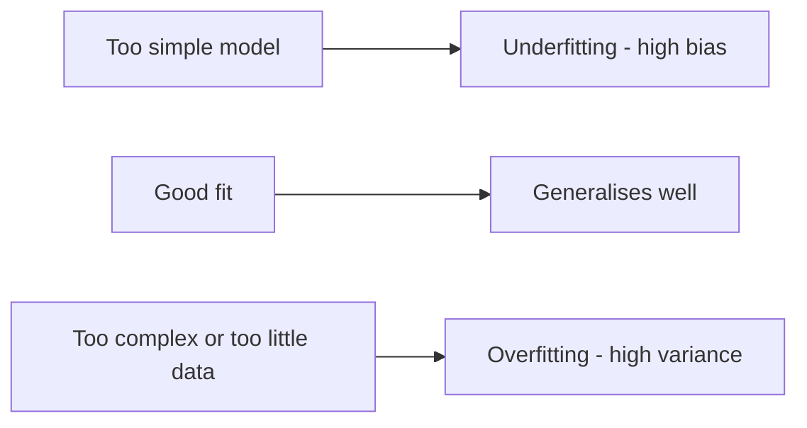
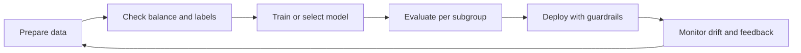
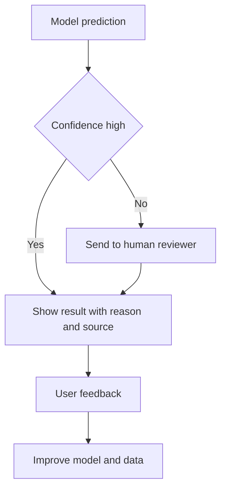

# Domain 4 course — Guidelines for Responsible AI (14%)

Domain 4 checks whether you can spot when an AI system might be unfair, unsafe, untruthful or impossible to explain, and which AWS tool or practice reduces each risk. It is about 14% of scored content, so roughly 7 of the 50 scored questions. There is no math and no code here. The questions are business scenarios: "a bank's model…", "a chatbot must never…", "auditors want…". Each one asks for the best practice or the best AWS feature.

**Study time:** about 5–6 hours. That is 3–4 h for the two modules, 1 h for Lab 05, and 1 h for the quiz and reviewing your mistakes.

**How to use this course**

1. Read one module, lesson by lesson. The `Exam tip` and `Trap` callouts are the parts most likely to earn you points.
2. Answer the **Check yourself** questions *before* you open the answers.
3. Do the lab: [Lab 05 guide](lab-05.md) (Guardrails). The console tour in [Lab 06 guide](lab-06.md) shows Model Evaluation.
4. Run `python quiz/quiz.py --domain 4`. Aim for 80% or more, then reread the lessons behind any miss.

> **Note on service availability (2026):** AWS documentation now says **Amazon SageMaker Clarify, SageMaker Model Monitor and Amazon Augmented AI (A2I) are no longer open to new customers**. Existing customers can keep using them. The exam can still describe what they do, because the concepts (bias metrics, SHAP explanations, drift monitoring, human review loops) are what is tested. Learn them as "the AWS tool for X". You may not be able to switch them on in a new account. For generative AI, AWS points to **Amazon Bedrock Evaluations** and **Amazon Bedrock Guardrails** as the managed path.

---

## Learning objectives

| Official task statement (v1.1) | Covered in |
|---|---|
| **4.1** Explain the development of AI systems that are responsible: features of responsible AI; tools such as Amazon Bedrock Guardrails; responsible model selection (environmental impact, sustainability); legal risks of GenAI; dataset characteristics; effects of bias and variance; tools to detect and monitor bias, trustworthiness and truthfulness | [Module 4.1](#module-41--explain-the-development-of-ai-systems-that-are-responsible), lessons 4.1.1–4.1.7 |
| **4.2** Recognize the importance of transparent and explainable models: transparent vs opaque models; tools (SageMaker Model Cards, Bedrock Model Evaluations, open source models, data, licensing); tradeoffs between safety and transparency (interpretability vs performance); human-centered design for explainable AI | [Module 4.2](#module-42--recognize-the-importance-of-transparent-and-explainable-models), lessons 4.2.1–4.2.4 |

After this domain you should be able to:

- name the dimensions of responsible AI and recognise each one in a scenario;
- explain where bias comes from and how a dataset should look;
- tell bias (underfitting) from variance (overfitting) and say why both hurt real people;
- pick the right Guardrails policy for a requirement;
- list the legal risks of GenAI and one mitigation for each;
- choose a model responsibly, including sustainability;
- tell transparent, explainable and opaque models apart, and pick the right documentation or evaluation tool;
- describe human-centered design for explainable AI.

---

## Module 4.1 — Explain the development of AI systems that are responsible

### Lesson 4.1.1 — What "responsible AI" means: the core dimensions

**Responsible AI** means building and using AI so that it helps people without harming them. In practice, a responsible system:

- treats people fairly;
- tells the truth;
- resists misuse;
- protects data;
- can be explained and controlled by humans.

AWS splits responsible AI into **dimensions**. Learn this list; the exam uses these words.

| Dimension | Plain meaning | Business example of a failure |
|---|---|---|
| **Fairness** | Outcomes don't unfairly differ across groups (gender, age, ethnicity…) | A hiring model rates women's CVs lower for the same experience |
| **Explainability** | You can understand *why* the system produced a given output | A customer is refused a loan and no one can say why |
| **Privacy and security** | Data is used appropriately and protected | A chatbot repeats another customer's phone number |
| **Safety** | The system avoids harmful output and misuse | A model gives instructions for something dangerous |
| **Controllability** | Humans can monitor and steer the system's behaviour | No way to stop an agent that is taking wrong actions |
| **Veracity and robustness** | Outputs are correct, and quality holds up with unexpected or adversarial input | A model invents a refund policy (hallucination), or breaks when a user adds typos |
| **Governance** | Processes, roles and records exist to manage AI risk | No one owns the model; no record of how it was approved |
| **Transparency** | Stakeholders know AI is being used, what it can do and its limits | Users don't know they are talking to a bot |

The exam guide also uses a few more words. Here is how they map:

- **Bias** is the *problem*; fairness is the *goal*. Bias is a systematic error that favours or disadvantages some group or outcome.
- **Inclusivity**: the system works for *everyone* it is meant to serve, including minorities, other languages, accessibility needs and different accents.
- **Robustness**: keeps working on noisy, unusual or hostile input.
- **Veracity**: truthfulness. Its GenAI enemy is the **hallucination**, a confident but false answer.
- **Safety**: no harmful content, and safe behaviour in the real world.

> **Analogy:** a responsible AI system is like a well-run bank branch. It treats every customer by the same rules (fairness). It can tell you why your loan was declined (explainability). It locks the vault (privacy and security). It won't help a robber (safety). A manager can override a teller (controllability). It doesn't invent interest rates (veracity). It keeps audit records (governance). And the sign on the door says what it offers (transparency).

> **Exam tip:** when a question lists a symptom, map it to a dimension first. "Can't tell why" → explainability. "Different results for group X" → fairness/bias. "Made-up facts" → veracity. "Leaks personal data" → privacy. "Users unaware it's AI" → transparency. "No owner or approval record" → governance.

> **Trap:** *transparency* and *explainability* are related but not identical. Transparency is openness about the system: that AI is used, how it was built, its limits. Explainability is about understanding a specific *decision or output*.

### Lesson 4.1.2 — Bias, fairness, inclusivity and dataset characteristics

A model learns patterns from examples. **If the examples are skewed, the model is skewed.** That is the single most important idea in this lesson.

**Where bias comes from**

| Source | What happens | Example |
|---|---|---|
| **Unrepresentative / imbalanced data** (sampling bias) | Some groups barely appear in training data | A face-matching model trained mostly on light-skinned faces fails more often on dark-skinned faces |
| **Historical bias** | Data faithfully records an unfair past | Past hiring favoured men, so "successful employee" labels favour men |
| **Label bias / poor label quality** | Humans who labelled data were inconsistent or prejudiced | Annotators mark dialect text as "toxic" more often |
| **Proxy features** | A harmless-looking feature stands in for a protected one | ZIP code correlates with ethnicity; first name correlates with gender |
| **Measurement bias** | Data is collected differently for different groups | One hospital's scanner produces sharper images than another's |
| **Feedback loops** | Model decisions shape future training data | A policing model sends patrols to area A, so more incidents are recorded in A |

**What a good dataset looks like.** The exam names these characteristics:

- **Inclusive**: covers all groups and situations the system will serve (ages, languages, accents, regions, devices).
- **Diverse**: varied examples, not thousands of near-duplicates.
- **Curated data sources**: known, trustworthy, licensed origin, cleaned and reviewed. You know where each record came from (data **provenance** and **lineage**).
- **Balanced**: important classes and groups are reasonably represented. Ten fraud cases in a million rows is *imbalanced*. The model may simply learn to say "not fraud".
- Also: accurate labels, relevant to the task, up to date, and privacy-respecting (consent, minimised personal data).

> **Business example:** a voice assistant for a national railway was trained on recordings from one city. It misunderstands rural accents, and complaints come mostly from older rural travellers. The fix is not a bigger model. It is a more **inclusive, diverse, balanced** dataset, plus testing per accent group.

**Ways to reduce bias** (practitioner level, no maths):

- collect more data for under-represented groups;
- re-sample or re-weight the data;
- remove or audit proxy features;
- improve labelling guidelines and use several reviewers per item;
- test results per group before launch;
- keep monitoring after launch.

> **Exam tip:** "the model performs worse for group X, and the training data has few examples of group X" → the root cause is **unrepresentative or imbalanced training data**, and the fix is **more diverse, balanced data**. It is not "use a bigger model" or "raise the temperature".

> **Trap:** deleting the protected attribute (for example "gender") does **not** guarantee fairness. Proxies such as name, ZIP code or shopping history can carry the same signal. You must still measure outcomes per group.

### Lesson 4.1.3 — Effects of bias and variance

The word "bias" has two meanings in this domain. The exam uses both.

1. **Social or ethical bias**: unfair treatment of groups (Lesson 4.1.2).
2. **Statistical bias vs variance**: two ways a model can be *wrong*.

| | High **bias** → **underfitting** | High **variance** → **overfitting** |
|---|---|---|
| What it is | Model too simple; misses real patterns | Model memorises training data, including noise |
| Training performance | Poor | Excellent |
| Test / real-world performance | Poor | Poor (big gap vs training) |
| Analogy | A student who learned only "the answer is usually C" | A student who memorised last year's exam word for word |
| Typical fix | More relevant features, more capable model, train longer | More (and more diverse) data, simpler model, regularisation, early stopping |
| Good target | **Balanced**: low bias and low variance, so it generalises to new data | |



**Why this is a responsible-AI topic.** Errors are rarely spread evenly, so both problems turn into real harm:

- **Inaccuracy**: wrong decisions such as wrong diagnoses, wrongly flagged transactions, or wrong answers given to customers.
- **Effects on demographic groups**: an overfitted model may work for the majority group it saw a lot of. It fails on a minority group it saw little of. An underfitted model may fall back on crude rules ("people from region R default more") that hit whole groups unfairly.
- **Loss of trust**: users stop relying on the system, or are harmed by it.

> **Exam tip:** "great on training data, poor on new data" → **overfitting / high variance**. "Poor on both" → **underfitting / high bias**. Fixing overfitting usually starts with **more and more diverse training data**. That fix is also a responsible-AI fix.

> **Trap:** don't confuse *statistical* bias (underfitting) with *demographic* bias. A question about a model performing worse "for women" or "for older users" is about **fairness**, even if the word "bias" appears in both meanings.

### Lesson 4.1.4 — Detecting and monitoring bias, trustworthiness and truthfulness

You cannot fix what you don't measure. The exam guide names three practices.

| Practice | What you do | Catches |
|---|---|---|
| **Analyse label quality** | Check that training labels are correct and consistent. Measure agreement between annotators, re-label samples, review label guidelines | Label bias, noisy labels that teach the model wrong things |
| **Human audits** | People (domain experts, a diverse review panel, an internal audit team) review samples of data and outputs, including edge cases | Harmful, biased or false outputs that metrics miss |
| **Subgroup analysis** | Compute accuracy, error rates and approval rates **per group** (age band, gender, region, language) and compare | Disparate performance hidden by a good overall average |

> **Business example:** a loan model is 92% accurate overall. Subgroup analysis shows 95% for applicants under 50 and 78% for applicants over 65. The headline number hid a fairness problem. Always slice the metrics by group.

**AWS tools for this.** Know what each one does and the keyword that points to it.

| Tool | What it does | Exam keyword |
|---|---|---|
| **Amazon SageMaker Clarify** | Measures **bias in data before training** (for example, class imbalance between groups) and **bias in predictions after training** (for example, differences in positive-prediction rates between groups). Also **explains predictions** with SHAP feature attributions and partial dependence plots | "detect bias", "which features drive predictions", "explain a prediction" |
| **Amazon SageMaker Model Monitor** | Watches a deployed SageMaker model and alerts on drift in **data quality, model quality, bias, and feature attribution** compared with a baseline | "in production", "over time", "drift", "alert" |
| **Amazon SageMaker Ground Truth** | Managed data labelling with human workers (your own, vendors, or public), including human preference data for GenAI | "label data", "improve label quality", "human feedback data" |
| **Amazon Augmented AI (A2I)** | Sends **low-confidence or randomly sampled predictions to humans** for review (built-in with Textract and Rekognition, or custom for your own models) | "human review", "low confidence", "human in the loop" |
| **Amazon Bedrock Evaluations** | Evaluates foundation models and RAG with automatic metrics (accuracy, robustness, toxicity), an LLM-as-a-judge (including **harmfulness, stereotyping, refusal, faithfulness, correctness**), or **human workers** | "compare FMs", "evaluate a model for toxicity / bias / correctness" |
| **Amazon Bedrock Guardrails** | Runtime safety: filters harmful content, checks grounding to catch hallucinations, checks answers against rules | "block", "filter", "mask PII", "hallucination check at runtime" |

**Trustworthiness and truthfulness for GenAI** combines several of these practices:

- test the model with a golden question set;
- use LLM-as-a-judge plus human spot checks;
- ground answers in your documents (RAG) and show citations;
- turn on Guardrails contextual grounding checks;
- collect user feedback and keep monitoring after launch.



> **Exam tip:** match the *moment* to the tool:
> - before training, on the data → **Clarify (pre-training bias)**;
> - after training, on predictions → **Clarify (post-training bias)**;
> - in production over time → **Model Monitor**;
> - a human checks individual outputs → **A2I**;
> - humans label training data → **Ground Truth**;
> - compare or score foundation models → **Bedrock Evaluations**.

> **Trap:** Clarify **measures and explains**; it does not automatically fix the bias or retrain the model. Model Monitor **alerts**; it does not block bad outputs. Guardrails **filter at runtime**; they do not retrain the model or remove bias from its weights.

> **Hands-on:** [Lab 06 guide](lab-06.md) walks through creating a Bedrock Model Evaluation job in the console.

### Lesson 4.1.5 — Amazon Bedrock Guardrails

**Amazon Bedrock Guardrails** is a configurable safety layer that sits around a generative AI app. It inspects the **user's input** before the model sees it, and the **model's output** before the user sees it. When content breaks a policy, the guardrail can block it with a custom message (for example "Sorry, I can't help with that"). Some policies can instead mask the content or just flag it.

> **Analogy:** the guardrail is the security desk in a lobby. It checks who comes in (prompts) and what leaves the building (responses). It doesn't change the people working inside (the model).

**The six policies.** Know every one; questions often describe a requirement and ask which policy fits.

| Policy | What it does | "If the question says…" |
|---|---|---|
| **Content filters** | Detects harmful **text or image** content in categories **Hate, Insults, Sexual, Violence, Misconduct**, plus **Prompt attack** (jailbreaks, prompt injection). Strength is configurable per category | "block toxic / hateful / violent content", "stop jailbreak or prompt injection attempts" |
| **Denied topics** | Blocks topics *you* define with a short natural-language description and examples | "the bot must never give investment / medical / legal advice", "don't discuss competitors' products" |
| **Word filters** | Blocks exact words or phrases (case-insensitive), including a ready-made profanity list | "block profanity", "never mention these product code names" |
| **Sensitive information filters** | Detects **PII** (email, phone, address, SSN, card numbers…) and **custom regex** patterns. Then **blocks** the content or **masks** it (replaces it with a placeholder) | "redact / mask customer phone numbers", "never return account IDs matching pattern X" |
| **Contextual grounding checks** | Scores whether a response is **grounded** in the provided source (not inventing facts) and **relevant** to the user's query. Blocks or flags responses below your threshold | "detect hallucinations in a RAG app", "answer must stick to the retrieved documents" |
| **Automated Reasoning checks** | Uses **formal logic** to check a response against a **policy built from your rules document**, for example an HR leave policy or insurance eligibility rules. Returns findings such as valid or invalid, plus the rules involved and suggested corrections. Works in **detect mode**: it gives feedback; it does not block by itself | "mathematically verify answers against company policy", "regulated industry needs provable, auditable correctness" |

**Other facts worth knowing**

- **Works with any model.** You can attach a guardrail to Bedrock inference calls (for example Converse or InvokeModel, by guardrail ID and version). You can also use it with Bedrock Agents and Knowledge Bases. With the standalone **`ApplyGuardrail` API**, you can check *any* text without calling a model. That covers text from models hosted outside Bedrock.
- **Draft and versions.** You edit a working draft, test it in the console test window, then publish an immutable **version** for production.
- **Input and output.** Each filter can apply to prompts, responses or both. In Lab 05, for example, the prompt-attack filter applies to input only.
- **Custom blocked messages** for input and output.
- **Tiers.** There are Classic and Standard safeguard tiers. Standard adds protections such as detecting harmful content hidden inside code elements.
- Guardrails **complement** good prompts, RAG and evaluation. They do not replace them.

**Choosing between grounding check and Automated Reasoning**

| | Contextual grounding check | Automated Reasoning checks |
|---|---|---|
| Compares the answer to… | The retrieved source text (and the query) | A formal policy of logical rules extracted from your documents |
| Technique | Model-based scoring with a threshold | Formal logic / mathematical verification |
| Typical use | RAG chatbot hallucination control | Regulated rules: eligibility, benefits, compliance |
| Action | Block or flag below the threshold | Detect only: returns findings and suggestions |

> **Exam tip:** one requirement that combines "never discuss X" and "hide personal data" → **one guardrail** with a **denied topic** plus a **sensitive information filter**. That is the least-effort answer. Don't pick fine-tuning, a custom classifier or prompt instructions alone.

> **Exam tip:** "detect hallucinations / ungrounded answers in a RAG application" → **contextual grounding check**. "Verify answers against formal rules with explainable, provable results" → **Automated Reasoning checks**.

> **Trap:** guardrails **do not retrain or change the model**. A question offering "Guardrails to remove bias from the model's training" is wrong. Also, Automated Reasoning checks do **not** protect against prompt injection. Use the **prompt attack** content filter for that.

> **Trap:** don't mix up the Guardrails *sensitive information filter* (masks PII in GenAI prompts and responses at runtime) with **Amazon Macie** (discovers sensitive data stored in S3, Domain 5) or **Amazon Comprehend** PII detection (an NLP API you call on text).

> **Hands-on:** [Lab 05 guide](lab-05.md). You create a guardrail with a denied topic, prompt-attack filter, PII masking and a grounding check, then watch it block, mask and flag real examples through `ApplyGuardrail`.

### Lesson 4.1.6 — Legal risks of working with generative AI

GenAI creates new content, so it creates new legal exposure. The exam lists five risks. Learn each risk with one mitigation.

| Risk | What it looks like | Mitigations |
|---|---|---|
| **Intellectual property (IP) infringement claims** | Generated text, code or images closely copy copyrighted or trademarked work, or the training data was used without rights | Check model provider terms and licensing. Prefer providers offering **IP indemnity** (AWS offers it for outputs of certain Amazon models under its service terms). Human review before publishing. Don't prompt for "in the style of" living artists or brands. Track the provenance of your training data |
| **Biased model outputs** | Stereotyped or discriminatory content or decisions, which can breach anti-discrimination law | Evaluate for stereotyping and harmfulness (Bedrock Evaluations). Guardrails. Diverse test sets. Human review for consequential decisions |
| **Loss of customer trust** | A public incident: offensive reply, false claim, leaked data | Guardrails, testing before launch, transparency ("you're chatting with an AI assistant"), quick escalation to humans |
| **End-user risk** | Users act on wrong advice (medical, financial, legal) or receive harmful content | Denied topics for advice areas. Disclaimers. Route to a qualified human. Human-in-the-loop for high-stakes outputs |
| **Hallucinations** | Confident false statements: invented policies, fake citations, defamatory claims about real people | RAG over trusted sources with citations. Contextual grounding checks. Automated Reasoning checks. Lower temperature. Human review |

Related risks that also appear in scenarios:

- **privacy** (personal data in prompts, training data or outputs);
- **data residency**;
- **lack of consent** for using personal data;
- not telling users that content is AI-generated.

Some image models on Bedrock, such as Amazon Nova Canvas, add an **invisible watermark** to generated images. That supports transparency about AI-generated content.

> **Business example:** a retailer uses an image model for ad campaigns. One generated image contains a recognisable logo from another company. Possible results: a trademark claim, a pulled campaign, and bad press. Controls: human creative review before publishing, a provider with clear licence and indemnity terms, and prompts that avoid brand names.

> **Exam tip:** "a legal risk *specific to* generative AI" → usually **IP or copyright infringement in generated content**, or **hallucinated / defamatory content**. Generic answers such as "server downtime" or "high cost" are not legal risks.

> **Trap:** "the model provider is responsible, so we have no risk" is wrong. The company that *deploys* the application is still accountable for what it publishes and decides.

### Lesson 4.1.7 — Responsible model selection: environment and sustainability

Choosing a model is also a responsible-AI decision. Bigger is not automatically better. Large models use more energy, cost more and respond more slowly. They are also harder to explain.

**Responsible selection checklist**

- **Fit for purpose:** does the model meet the accuracy, safety and language needs of *this* task? Check model cards, AI Service Cards and benchmark or evaluation results.
- **Smallest model that meets requirements:** for example, a small text model for classification or FAQ answers, not the biggest model available.
- **Reuse before you build:** use or customise an existing foundation model (prompting, RAG, light fine-tuning). Training from scratch uses far more compute and energy.
- **Efficient infrastructure:** AWS purpose-built chips use less energy for ML work. **AWS Inferentia** is for inference, **AWS Trainium** for training, and **AWS Graviton** CPUs for general compute. Use managed or serverless options so you don't leave capacity idle.
- **Efficient usage:** shorter prompts, caching, batching, and choosing on-demand vs provisioned capacity sensibly.
- **Region choice:** regions powered by more renewable energy lower the carbon footprint (if data residency allows). The AWS Well-Architected Framework has a **Sustainability pillar**.
- **Responsible-AI evidence:** the provider documents intended use, limits and safety testing. The licence terms allow your use case. The model can be used with guardrails.
- **Distillation:** transfer a large model's skill into a smaller one to cut inference energy and cost (covered in Domain 3).

> **Business example:** a support team wants to sort 50,000 emails a day into 8 categories. A small model, evaluated on a sample of their emails, reaches the target accuracy. Choosing it over the largest model saves cost and energy. It is also faster and simpler to monitor. That is the responsible choice.

> **Exam tip:** "reduce environmental impact" → **reuse a pre-trained FM** instead of training from scratch, **choose the smallest adequate model**, and use **efficient hardware (Inferentia / Trainium / Graviton)**.

> **Trap:** "always choose the most accurate, largest model" is not the responsible default. The exam favours the option that **meets requirements** with the least waste and risk.

### Check yourself

**1.** An insurance company's chatbot answers policy questions using retrieved policy documents. Sometimes it adds coverage details that appear nowhere in the documents. Which control most directly detects this at runtime?

A. A word filter listing all coverage terms
B. A contextual grounding check in Amazon Bedrock Guardrails
C. SageMaker Model Monitor data quality monitoring
D. Increasing the model's temperature

<details><summary>Answer</summary>

**B.** The contextual grounding check scores whether the response is grounded in the source passages and relevant to the query. It can block or flag ungrounded answers, which are hallucinations.
A blocks exact words; it can't tell invented facts from real ones. C watches tabular data drift for SageMaker models; it doesn't check GenAI answers against sources. D makes output *more* random, which tends to increase hallucination.
</details>

**2.** A recruiting startup finds its CV-screening model recommends fewer candidates from one university group, even though their qualifications are equal. The team removed the "university" column, but the gap remains. What is the most likely explanation?

A. The model is underfitting because it is too simple
B. Other features act as proxies for the removed attribute
C. The temperature setting is too high
D. The model needs a denied topic guardrail

<details><summary>Answer</summary>

**B.** Removing a column doesn't remove its signal. Features such as city, internship employer or writing style can correlate with it (proxy bias). Measure outcomes per subgroup and audit those features.
A: underfitting causes poor accuracy for everyone, not a group-specific gap. C: temperature applies to generative sampling, not a screening classifier's bias. D: guardrails filter GenAI text and don't fix a classifier's learned bias.
</details>

**3.** A model scores 99% accuracy on its training data but only 71% on new customer data. Which statement is correct?

A. The model has high bias and is underfitting; use a simpler model
B. The model has high variance and is overfitting; add more diverse training data
C. The model is well balanced; deploy it
D. The model is suffering from a prompt injection attack

<details><summary>Answer</summary>

**B.** A large gap between training and real-world performance is the signature of overfitting (high variance). More, and more diverse, data is a standard fix and also improves fairness.
A: underfitting means poor *training* performance too. C: the 28-point gap is not balanced. D: prompt injection is a GenAI input attack, unrelated to training accuracy.
</details>

**4.** A bank's virtual assistant must never recommend specific stocks. It must also replace customer email addresses in responses with a placeholder. What is the least-effort way to meet both requirements?

A. Fine-tune the model on conversations without stock advice or emails
B. Configure one Amazon Bedrock guardrail with a denied topic and a sensitive information filter set to mask emails
C. Use Amazon Macie to scan the chatbot's responses
D. Add both rules to the system prompt only

<details><summary>Answer</summary>

**B.** Denied topics block the subject you define. The sensitive information filter masks PII such as email addresses. Both are configured on one guardrail with no training.
A is costly and gives no guarantee. C: Macie discovers sensitive data stored in S3; it doesn't filter live chat responses. D: prompt instructions alone can be ignored or bypassed. A guardrail enforces the rules outside the model.
</details>

**5.** A marketing team wants to use an image-generation model for public ad campaigns. Legal asks which risk is *most specific* to this generative AI use. Which is it?

A. The model's API may have higher latency during peak hours
B. Generated images may infringe someone else's copyright or trademark
C. The images will need more storage space in Amazon S3
D. The team may exceed its AWS Budgets threshold

<details><summary>Answer</summary>

**B.** IP infringement claims over generated content are a core legal risk of GenAI. Mitigate with licensing and indemnity terms, human review and careful prompting.
A, C and D are operational or cost concerns, not legal risks specific to generated content.
</details>

**6.** A company needs a model to tag support tickets into 10 categories, and wants to minimise its environmental impact. Which approach is most responsible?

A. Train a new large language model from scratch on all company data
B. Use the largest available foundation model for every ticket to maximise accuracy
C. Evaluate small pre-trained models on sample tickets and choose the smallest one that meets the accuracy target
D. Run the model on always-on GPU instances to avoid cold starts

<details><summary>Answer</summary>

**C.** Reusing a pre-trained model and choosing the smallest one that meets requirements cuts energy, cost and latency. It is the responsible-selection principle.
A: training from scratch uses by far the most compute. B over-sizes the model for a simple task. D keeps capacity running idle and wastes energy.
</details>

---

## Module 4.2 — Recognize the importance of transparent and explainable models

### Lesson 4.2.1 — Transparent, explainable and opaque models

People need to trust, check and challenge AI decisions, especially when those decisions affect jobs, money, health or legal status. Three words describe how much we can see:

| Term | Meaning | Examples |
|---|---|---|
| **Transparent (interpretable)** | You can see *how* the model decides, by reading the model itself | Linear or logistic regression (each feature has a visible weight), a small decision tree (you can follow the if/then path), rule-based systems |
| **Explainable** | Even if the inside is complex, tools can explain *why* it gave a particular output | A gradient-boosted model plus **SHAP** feature attributions ("income contributed most to this decline"). A RAG answer with **citations** to its sources |
| **Opaque ("black box")** | Internal logic can't be meaningfully inspected by people | Deep neural networks and large foundation models with billions of parameters |

**Two scopes of explanation**

- **Global**: which features matter most to the model overall. Example: "payment history is the top driver of all credit decisions".
- **Local**: why *this one* prediction came out this way. Example: "your application was declined mainly because of a high debt-to-income ratio". Regulated decisions often need local explanations for each applicant.

> **Analogy:** a transparent model is a recipe card; you can read every step. An explainable black box is a famous chef who won't share the recipe but tells you, for this dish, "the flavour comes mostly from smoked paprika". An opaque model is a vending machine: food comes out, and that's all you know.

**Transparency is wider than the model.** It also includes being open about:

- the **data** (where it came from, licence, known gaps);
- the **purpose and limits** (intended and out-of-scope uses);
- the **evaluation** (how it was tested, results per subgroup);
- the **fact that AI is used**, by disclosing it to users.

> **Exam tip:** "a regulator requires every individual decision to be explained to the applicant" → choose an **interpretable model** (or an explainable model with per-decision feature attributions). Also document it with a **model card**. Don't pick the most complex model "because it is more accurate".

> **Trap:** an FM that writes an explanation of its own reasoning is **not** a reliable explanation. The text it generates may not reflect how it actually computed the answer. For GenAI, transparency usually comes from **documentation, citations or grounding, evaluations and disclosure**, not from opening up the model.

### Lesson 4.2.2 — Tools that support transparency and explainability

The exam guide names **SageMaker Model Cards, Bedrock Model Evaluations, open source models, data and licensing**. Add **AWS AI Service Cards** and **SageMaker Clarify's explainability** to the list.

**Amazon SageMaker Model Cards: the model's "passport"**

A model card stores the key facts about one ML model in a single place, for governance and audits:

- **intended uses** and the uses it is *not* intended for;
- **risk rating**: unknown, low, medium or high;
- model overview: owner, creator, algorithm, problem type;
- business details: problem solved, stakeholders;
- **training details**: datasets, metrics, environment;
- **evaluation results**: you can upload Clarify or Model Monitor reports;
- **additional information**: ethical considerations, caveats and recommendations, custom fields.

Cards can be **exported to PDF** to share with auditors. Edits create **new versions**, so you keep an immutable history. Model Cards integrate with the SageMaker **Model Registry**.

> **Business example:** before a credit model goes live, the risk committee asks: "What is it for? What must it never be used for? What data trained it? How does it perform for each age group? Who owns it?" One model card answers all of these. It is the record auditors ask for.

**AWS AI Service Cards: AWS's transparency documents for its own AI services**

AWS publishes AI Service Cards for some of its services and models (for example Amazon Rekognition face matching, Amazon Textract, Amazon Transcribe and Amazon Nova models). Each card describes:

- intended use cases and limitations;
- the responsible-AI design choices AWS made;
- deployment and performance best practices.

Read them when you *use* an AWS AI service. Write your own Model Card when you *build or deploy* your own model.

| Question asks for… | Pick |
|---|---|
| Documentation of **your own** model for governance / auditors | **SageMaker Model Cards** |
| AWS's documentation of the intended use and limits of **an AWS AI service** | **AWS AI Service Cards** |
| **Explain which features drove** a prediction; detect data or model bias | **SageMaker Clarify** |
| **Compare or score foundation models** on your prompts (accuracy, robustness, toxicity, judge metrics, human ratings) | **Amazon Bedrock Evaluations** |
| Show **sources** behind a GenAI answer | RAG with **citations** (Bedrock Knowledge Bases), plus contextual grounding check |
| Inspect weights, architecture, training data and licence yourself | **Open source / open-weight models** with published model cards and data documentation (for example from SageMaker JumpStart or Bedrock) |

**Amazon Bedrock Evaluations (Model Evaluation)**

- **Automatic (programmatic)** jobs: built-in or your own prompt datasets. Metrics such as **accuracy, robustness and toxicity** for tasks like summarisation, Q&A, classification and text generation.
- **LLM-as-a-judge** jobs: a second "evaluator" model scores responses and explains each score. Built-in metrics include **correctness, completeness, faithfulness, helpfulness, coherence, relevance, following instructions, professional style**, and responsible-AI metrics **harmfulness, stereotyping and refusal**. You can also define custom metrics.
- **Human-based** jobs: your own work team (for example employees or subject-matter experts) rates or compares responses, for up to two models per job. Use this for subjective qualities such as tone, brand voice or helpfulness.
- **RAG evaluations**: score how well a knowledge base retrieves and how well it generates answers.
- Results are published as a report. That makes the choice of model evidence-based and documented, which is itself a transparency practice.

**Open source models, data and licensing**

- Open-weight models (for example Llama or Mistral models available on Bedrock or JumpStart) let you see the architecture and weights. Their publishers often release model cards and some training-data documentation.
- **Licensing matters:** some "open" licences restrict commercial use, user counts or certain fields. Always check that the licence fits your use case. It is a transparency and a legal concern (Lesson 4.1.6).
- **Open datasets** with documentation ("datasheets") help you judge bias and provenance before training.

> **Exam tip:** keywords for Model Cards are "intended use", "risk rating", "single place for governance", "auditors", "documentation". The keywords "feature importance", "SHAP" and "bias metrics" point to **Clarify**, not Model Cards.

> **Trap:** Model Cards **document** a model; they don't *measure* bias or *monitor* production. The common swap is: Clarify = measure and explain; Model Monitor = watch production; Model Cards = write it down.

> **Hands-on:** [Lab 06 guide](lab-06.md) (Bedrock console tour) includes Model Evaluation. For the capstone, you write a model card for your assistant (see `capstone/README.md`, Deliverable 2), mirroring the SageMaker Model Card fields.

### Lesson 4.2.3 — Tradeoffs between model safety and transparency

You rarely get everything at once. The exam guide asks you to recognise these tradeoffs.

**1. Interpretability vs performance.** Simple, transparent models (linear models, small trees) are easy to explain but may be less accurate on complex data such as images, free text and speech. Deep networks and FMs often perform better but are opaque.

| Situation | Usually favour |
|---|---|
| High-stakes, regulated individual decisions (credit, hiring, insurance pricing, medical triage) | **Interpretability**, or strong explainability, even at some cost in accuracy |
| Low-stakes, high-volume tasks (product recommendations, photo tagging, email routing) | **Performance**, with monitoring |
| Unstructured data where only deep models work well (images, speech, open-ended text) | Performance, plus explainability tools, human review and documentation |

**How to "measure" the tradeoff.** Evaluate candidate models on the same test set and compare their accuracy metrics. Note for each one how explainable it is: a transparent model, an explanation tool such as SHAP, or no explanation at all. Then choose the simplest model whose performance is acceptable for the risk level. Record the decision in the model card.

**2. Safety vs transparency.**

- Publishing *everything* (exact guardrail rules, detection thresholds, full system prompts, training data) can help attackers bypass safety controls or extract private data. Full openness is not always safe.
- Publishing training data can expose **personal or confidential information** (a privacy conflict).
- Strong safety filtering can make the system feel **less transparent** to users ("why was my question blocked?"). Clear, honest blocked-content messages help.
- **Balance:** be transparent about *what* the system does, its limits and how decisions are made. Protect the *sensitive details* that would enable misuse: exact security configurations, personal data.

**3. Other common tradeoffs**

- Accuracy vs fairness: tuning for overall accuracy can widen subgroup gaps.
- Safety vs helpfulness: strict filters lead to more refusals.
- Explainability vs latency and cost: computing explanations takes time.

> **Exam tip:** the "best" answer for regulated decisions is almost never "the most accurate deep model with no explanation". Look for an answer that **balances** performance with explainability and documents it.

> **Trap:** "more transparency is always safer" is false. Exposing guardrail internals or private training data can *reduce* safety and privacy.

### Lesson 4.2.4 — Human-centered design for explainable AI

**Human-centered design** means building the AI experience around the people who use it or are affected by it. Those people must be able to understand it, question it and correct it.

**Principles the exam expects**

| Principle | In practice | Example |
|---|---|---|
| **AI decision transparency** | Tell users when AI is involved, show *why* (main reasons, sources) and how confident it is | "Suggested by AI, based on your last 3 orders" or "Answer from: Returns Policy, section 2" |
| **User-feedback mechanisms** | Let users rate, flag or correct outputs, and feed that back into improvement | Thumbs up/down on chatbot answers, a "report a problem" link, appeal forms |
| **Human oversight / human-in-the-loop** | People review or approve consequential or low-confidence decisions | Low-confidence document extractions go to a reviewer via **Amazon A2I**; a loan decline goes to an officer |
| **Ability to override and contest** | Users or operators can correct the AI and request human review | "Talk to a person" button; an officer can reverse the model's decision |
| **Design for the audience** | Explanations fit the reader: plain language for customers, more detail for analysts and auditors | Customer sees "high debt-to-income ratio". The auditor sees the feature attributions and the model card |
| **Accessibility and inclusivity** | Works for different abilities, languages and levels of literacy | Voice and text options, multiple languages |
| **Clear expectations** | State what the system can and can't do | "This assistant can't give medical advice" |



> **Business example:** a hospital uses AI to pre-read scans. Human-centered design means the AI highlights the regions it found suspicious and shows a confidence level. A radiologist always makes the final call. Disagreements are logged to improve the model. Patients are told AI assisted the reading.

**AWS mapping**

- Human review loops → **Amazon A2I**.
- Human-labelled data and human preference data → **SageMaker Ground Truth**.
- Human evaluation of FMs → **Bedrock Evaluations (human-based jobs)**.
- Showing sources → **Bedrock Knowledge Bases citations**.
- Explaining feature influence → **SageMaker Clarify**.

> **Exam tip:** "which design choice supports human-centered, explainable AI?" → look for **showing reasons or confidence**, **letting users give feedback or appeal**, and **human review of high-impact decisions**. Answers that hide AI involvement, or fully automate high-stakes decisions with no recourse, are wrong.

> **Trap:** "human-in-the-loop" does not mean humans review *every* prediction. Typically you route **low-confidence or high-impact** cases plus a **random sample** for audit. That is exactly the A2I pattern.

### Check yourself

**1.** A lender must give each rejected applicant the main reasons for their rejection, and regulators may audit the process. Which approach best meets this?

A. Use the most accurate deep neural network available and keep its internals confidential
B. Use an interpretable model, or provide per-decision feature attributions, and document the model in a SageMaker Model Card
C. Ask a foundation model to write a justification for each decision after the fact
D. Increase the training data volume so explanations are not needed

<details><summary>Answer</summary>

**B.** Regulated individual decisions need local explanations (interpretable model or feature attributions such as SHAP via Clarify). They also need governance documentation (Model Card).
A gives no explanation. C: an FM's generated justification may not reflect how the decision was actually made. D: more data improves accuracy but doesn't make decisions explainable.
</details>

**2.** An internal audit team wants a single, versioned record for each production ML model. It should show the model's intended use, out-of-scope uses, risk rating, training data and evaluation results, and be exportable as a PDF. Which feature fits?

A. Amazon SageMaker Model Monitor
B. Amazon SageMaker Clarify
C. Amazon SageMaker Model Cards
D. AWS AI Service Cards

<details><summary>Answer</summary>

**C.** Model Cards document intended use, risk rating, training and evaluation details, keep version history, and export to PDF.
A monitors drift in production. B measures bias and explains predictions; its reports can be *attached* to a card, but it is not the record. D documents AWS's own AI services, not your models.
</details>

**3.** A product team must choose between two foundation models for a customer-facing assistant. They want evidence of which one gives more correct answers and less harmful or stereotyped content on their own prompts. Which approach is most appropriate?

A. Read each provider's marketing page
B. Run an Amazon Bedrock Evaluations job, for example with LLM-as-a-judge metrics including correctness, harmfulness and stereotyping, on the team's prompt dataset
C. Enable SageMaker Model Monitor on both models
D. Choose the model with the most parameters

<details><summary>Answer</summary>

**B.** Bedrock Evaluations compares models on your own prompts with quality and responsible-AI metrics. It produces a documented, evidence-based report.
A is not evidence. C monitors deployed SageMaker models for drift; it doesn't compare FMs before choosing one. D: size doesn't guarantee correctness or safety.
</details>

**4.** A company plans to publish its chatbot's full system prompt, guardrail thresholds and denied-topic definitions on its website "for maximum transparency". What is the main concern?

A. It will increase token costs
B. Publishing detailed safety configurations can help attackers craft inputs that bypass the safeguards
C. Guardrails stop working once their settings are public
D. It violates the AWS shared responsibility model

<details><summary>Answer</summary>

**B.** This is the safety vs transparency tradeoff. Be open about what the system does and its limits, but don't publish details that enable misuse.
A: publishing has no effect on tokens. C: guardrails keep working; they just become easier to probe. D: the shared responsibility model isn't about publishing configuration.
</details>

**5.** An insurer extracts data from claim forms. Most extractions are accurate, but some handwritten forms produce low-confidence results. The insurer wants humans to check only those uncertain cases. Which AWS capability is designed for this?

A. Amazon Augmented AI (A2I)
B. Amazon Bedrock Guardrails word filters
C. Amazon SageMaker Model Cards
D. AWS AI Service Cards

<details><summary>Answer</summary>

**A.** A2I creates human review workflows triggered by low-confidence predictions (built in for Amazon Textract) or random samples.
B blocks specific words in GenAI text. C documents models. D describes AWS services. None of them routes work to human reviewers.
</details>

**6.** Which design feature best supports human-centered, explainable AI in a customer-facing product recommendation app?

A. Hiding that recommendations are AI-generated to keep the experience seamless
B. Showing a short reason for each recommendation and letting users mark items as "not relevant"
C. Retraining the model daily without collecting user input
D. Removing all options for users to change their preferences

<details><summary>Answer</summary>

**B.** It provides decision transparency (a reason) and a user-feedback mechanism that improves the system.
A undermines transparency. C ignores user feedback. D removes user control.
</details>

---

## Domain summary

| Topic | Remember |
|---|---|
| **Responsible AI dimensions (AWS)** | Fairness · Explainability · Privacy & security · Safety · Controllability · Veracity & robustness · Governance · Transparency |
| **Exam-guide feature words** | Bias (the problem) · fairness (the goal) · inclusivity (works for everyone) · robustness · safety · veracity (truthful, no hallucination) |
| **Bias sources** | Imbalanced/unrepresentative data, historical bias, label bias, proxy features, measurement bias, feedback loops |
| **Good dataset** | Inclusive, diverse, curated (known provenance and licence), balanced, accurately labelled, privacy-respecting |
| **Bias vs variance** | High bias = underfitting (poor everywhere). High variance = overfitting (great on training data, poor on new data) → more diverse data, simpler model. Both cause inaccuracy and uneven harm to groups |
| **Detect / monitor** | Label-quality analysis · human audits · **subgroup analysis** (slice metrics by group) |
| **Tool by moment** | Data before training → Clarify pre-training bias · predictions → Clarify post-training bias + SHAP · production over time → Model Monitor · human checks of outputs → A2I · human labelling → Ground Truth · compare FMs → Bedrock Evaluations · runtime filtering → Guardrails |
| **Guardrails policies** | Content filters (hate, insults, sexual, violence, misconduct, **prompt attack**; text and image) · denied topics · word filters · sensitive info (PII / regex → block or **mask**) · **contextual grounding** (grounded + relevant → hallucination) · **Automated Reasoning** (formal-logic check against policy rules, detect mode) |
| **Guardrails facts** | Input and output · any model via **ApplyGuardrail** · draft → versions · custom blocked messages · does **not** retrain the model |
| **GenAI legal risks** | IP infringement · biased output · loss of trust · end-user risk · hallucinations → licensing/indemnity, human review, guardrails, RAG + citations, disclosure |
| **Responsible model selection** | Smallest adequate model · reuse FMs, don't train from scratch · Inferentia/Trainium/Graviton · greener regions · check licence and model / service cards |
| **Transparent vs explainable vs opaque** | Transparent = see the logic (linear, tree). Explainable = tools explain outputs (SHAP, citations). Opaque = black box (deep nets, FMs) |
| **Documentation** | Your model → **SageMaker Model Cards** (intended use, risk rating, training, evaluation, PDF, versions). AWS's services → **AWS AI Service Cards** |
| **Bedrock Evaluations** | Automatic (accuracy, robustness, toxicity) · LLM-as-a-judge (correctness, faithfulness, harmfulness, stereotyping, refusal…) · human workers (up to 2 models) · RAG evaluation |
| **Tradeoffs** | Interpretability vs performance (regulated → interpretability) · safety vs transparency (don't publish exploitable details) · safety vs helpfulness |
| **Human-centered XAI** | Disclose AI use · show reasons, sources and confidence · feedback buttons · human review of low-confidence / high-impact cases · override and appeal · explanations suited to the audience |

---

## Service glossary

| Service / feature | What it does | Exam keyword |
|---|---|---|
| **Amazon Bedrock Guardrails** | Configurable runtime safeguards on GenAI inputs and outputs (content, topics, words, PII, grounding, automated reasoning) | "block", "mask PII", "denied topic", "prompt attack", "hallucination check" |
| **Contextual grounding check** (Guardrails) | Scores whether a response is grounded in source text and relevant to the query | "RAG hallucination", "not in the documents" |
| **Automated Reasoning checks** (Guardrails) | Formal-logic verification of responses against rules extracted from your policy documents | "provable", "verify against policy rules", "regulated" |
| **ApplyGuardrail API** | Applies a guardrail to any text without invoking a model | "models outside Bedrock", "check text independently" |
| **Amazon Bedrock Evaluations** | Automatic, LLM-as-a-judge, human-based and RAG evaluations of models and knowledge bases | "compare FMs", "toxicity / robustness / accuracy", "human evaluators" |
| **Amazon SageMaker Clarify** | Pre- and post-training bias metrics; SHAP and partial dependence explanations (no longer open to new customers) | "detect bias", "feature importance", "explain prediction" |
| **Amazon SageMaker Model Monitor** | Monitors deployed models for data-quality, model-quality, bias and feature-attribution drift (no longer open to new customers) | "production", "drift", "over time", "alert" |
| **Amazon SageMaker Model Cards** | Versioned documentation of a model's intended use, risk rating, training and evaluation; PDF export | "governance record", "auditors", "intended use", "risk rating" |
| **Amazon SageMaker Model Registry** | Catalogues model versions and approval status; integrates with Model Cards | "model versions", "approval" |
| **Amazon SageMaker Ground Truth** | Human data labelling, including human feedback / preference data | "label quality", "labelling workforce" |
| **Amazon Augmented AI (A2I)** | Human review workflows for low-confidence or sampled predictions (Textract, Rekognition, custom) (no longer open to new customers) | "human in the loop", "low confidence review" |
| **AWS AI Service Cards** | AWS-published transparency documents on intended use, limits and responsible design of AWS AI services | "AWS's documentation of its service limits" |
| **Amazon SageMaker JumpStart** | Hub of pre-trained and open-weight models with model details and licences | "open source model", "pre-trained model hub" |
| **Amazon Bedrock Knowledge Bases** | Managed RAG that returns answers with source citations | "citations", "grounded answers" |
| **AWS Inferentia / AWS Trainium / AWS Graviton** | Energy-efficient chips for inference, training and general compute | "sustainability", "reduce environmental impact" |
| **AWS Well-Architected Tool** (Sustainability pillar) | Reviews workloads against best practices, including sustainability | "sustainability best practices" |

---

## Ready for the next domain?

- [ ] I can list the 8 AWS responsible-AI dimensions and match a scenario symptom to each.
- [ ] I can name 5 sources of bias and describe what an inclusive, diverse, curated, balanced dataset looks like.
- [ ] I can tell overfitting from underfitting from train vs test results, and explain how each harms groups.
- [ ] I know the three detection practices (label quality, human audits, subgroup analysis) and the AWS tool for each moment (Clarify, Model Monitor, A2I, Ground Truth, Bedrock Evaluations).
- [ ] I can name all six Guardrails policies and choose one from a requirement in under 10 seconds.
- [ ] I can explain contextual grounding vs Automated Reasoning checks.
- [ ] I can list the five GenAI legal risks and one mitigation each.
- [ ] I can explain responsible model selection, including sustainability.
- [ ] I can define transparent vs explainable vs opaque and global vs local explanations.
- [ ] I know when to use Model Cards vs AI Service Cards vs Clarify vs Bedrock Evaluations.
- [ ] I can describe the interpretability/performance and safety/transparency tradeoffs.
- [ ] I can list 4 human-centered design practices for explainable AI.
- [ ] I completed [Lab 05](lab-05.md) and deleted the guardrail afterwards.

Then test yourself:

```bash
python quiz/quiz.py --domain 4
```

Score 80% or more → move on to Domain 5 (Security, Compliance and Governance). Domain 5 builds directly on guardrails, privacy and governance.
